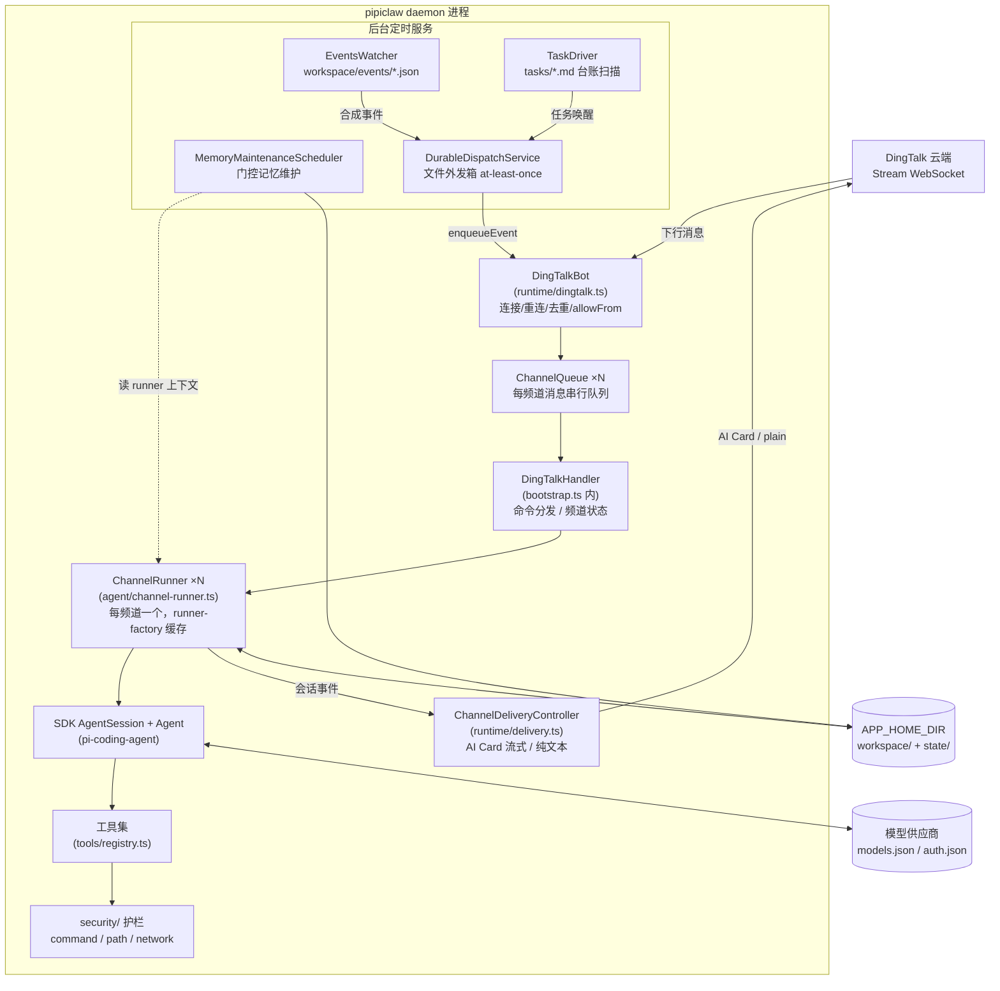
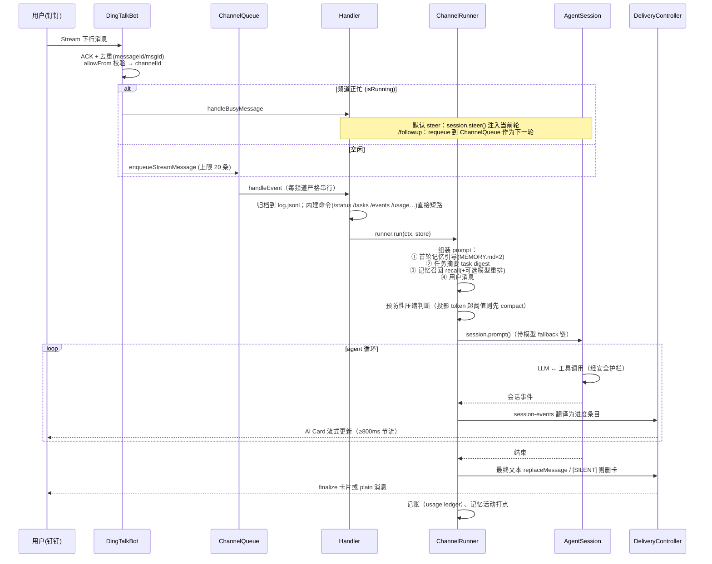
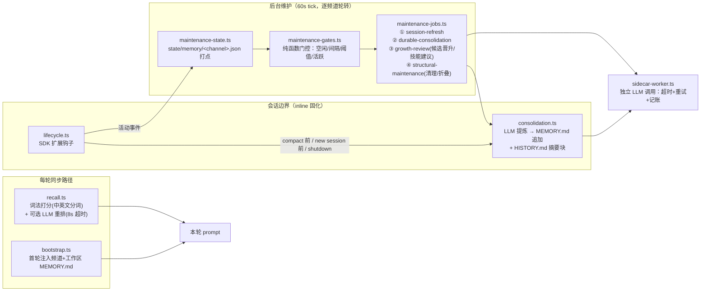
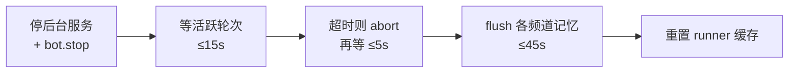

# Pipiclaw 架构

> 本文基于 v0.8.x 的实际实现整理，描述"代码现在是什么样"，而非设计愿景。各子系统的设计动机见 `docs/specs/NNN-*`；配置细节见 `docs/configuration.md`。

## 1. 定位与总体形态

Pipiclaw 是一个**长驻运行时（daemon）**：它包装 `@earendil-works/pi-coding-agent` SDK（`@mariozechner/pi-coding-agent` 的 fork），把一个 coding agent 挂到钉钉（DingTalk Stream 模式）上，并补齐了一个个人助手长期运行所需的外围系统——按频道隔离的会话与记忆、定时事件、持久任务、子代理、安全护栏、用量账本。同一套 agent 内核还有第二个传输前端：终端 TUI。

```
pipiclaw            # 默认：长驻钉钉 daemon（等价 pipiclaw run）
pipiclaw tui [提示] # 终端聊天，同一 agent 内核，无需钉钉凭据
```

核心设计取向（从实现中反推出来的一致性原则）：

| 原则 | 体现 |
|---|---|
| **频道（channel）是隔离单元** | 每个钉钉会话（`dm_<staffId>` / `group_<conversationId>`）拥有独立的 ChannelRunner、AgentSession、记忆文件、任务台账、串行队列 |
| **一切串行化都显式建模** | 消息队列、投递队列、记忆写队列各司其职（见 §5），共享文件用 write-temp-then-rename 原子写 |
| **传输层与 agent 层解耦** | Runner 只依赖 `ChannelContext` 投递契约，不知道钉钉存在；TUI 是第二个实现 |
| **状态全部落在仓库外** | 配置、工作区、记忆、任务、日志都在 `APP_HOME_DIR`（`~/.pi/pipiclaw`，可用 `PIPICLAW_HOME` 覆盖） |
| **后台工作是"扫描 + 门控"** | 记忆维护、任务驱动都是定时 tick + 确定性 gate，LLM 只在 gate 放行后才被调用 |

## 2. 源码地图

| 目录 | 职责 | 关键文件 |
|---|---|---|
| `src/runtime/` | 传输与运行时编排：钉钉连接、消息分发、投递、后台服务装配 | `bootstrap.ts`（装配根）、`dingtalk.ts`（传输）、`delivery.ts`（投递控制器）、`events.ts`、`task-driver.ts`、`durable-dispatch.ts` |
| `src/agent/` | 单频道 agent 编排：组装 SDK 会话、跑一轮、流式回传 | `channel-runner.ts`（核心编排器）、`session-events.ts`、`prompt/`（system prompt 流水线）、`model-fallback.ts` |
| `src/memory/` | 分层记忆子系统：召回、固化、门控维护流水线 | `lifecycle.ts`、`recall.ts`、`consolidation.ts`、`scheduler.ts`、`maintenance-{jobs,gates,state}.ts`、`sidecar-worker.ts` |
| `src/tools/` | 交给 agent 的工具集，单一声明式注册表 | `registry.ts`（唯一事实源）、各 `create*Tool` |
| `src/security/` | 所有工具共用的三道护栏 + 审计日志 | `command-guard.ts`、`path-guard.ts`、`network.ts`、`logger.ts` |
| `src/subagents/` | 子代理发现与 `subagent` 工具 | `discovery.ts`、`tool.ts` |
| `src/tasks/` + `src/shared/task-ledger.ts` | 持久任务的控制块、验证、存储 | `control.ts`、`store.ts`、`verification.ts` |
| `src/runtime/events.ts` + `src/tools/event-manage.ts` | 定时/传感器事件 | — |
| `src/tui/` | 终端前端（第二个 `ChannelContext` 实现） | `cli.ts`、`app.ts`、`turn-controller.ts` |
| `src/web/` | web_search / web_fetch 的搜索供应商、抓取、正文提取、代理 | `search.ts`、`fetch.ts`、`extract.ts` |
| `src/usage/` | 用量/成本账本（JSONL） | `ledger.ts`、`render.ts` |
| `src/playbooks/` | 随包发布的只读运行时手册（agent 按需 read） | `catalog.ts` + `*.md` |
| `src/shared/` | 串行队列、原子写、JSONL appender 等基础件 | `serial-queue.ts`、`atomic-file.ts` |
| `src/paths.ts` | 所有磁盘路径的集中定义 | — |
| `src/main.ts` | 薄入口：`run`→daemon，`tui`→终端 | — |

## 3. 运行时拓扑

`bootstrap()`（`src/runtime/bootstrap.ts`）是唯一的装配根：加载配置 → 初始化 `APP_HOME_DIR` → 构造下图所有组件并互相接线。前台是消息驱动的主链路，后台是四个定时服务。



要点：

- **`DingTalkBot`** 负责连接稳定性（心跳 ping/pong、90s 超时强制重连、指数退避、双层消息去重、`allowFrom` 白名单）和 AI Card 的 HTTP 调用（创建、流式更新、finalize，均带 15s 超时）。
- **合成事件不直接进内存队列**：EventsWatcher 和 TaskDriver 产生的事件先写入 `DurableDispatchService`（`state/dispatch/*.json` 文件外发箱，15 分钟租约，30s 重扫），保证进程崩溃后 at-least-once 重放，然后才 `bot.enqueueEvent`。
- **ChannelRunner 按 `(appHomeDir, channelDir, channelId)` 缓存**（`runner-factory.ts` 中的进程级 Map），一个频道全程复用同一个 SDK 会话。

## 4. 一条消息的生命周期



细节补充：

- **忙时语义**：任务流式进行中，内建命令（`/help /stop /steer /followup /events /tasks /status /usage`）仍可用；普通消息按 `busyMessageDefault`（默认 `steer`）注入当前轮；`/stop` 会中止当前轮、丢弃排队消息、暂停关联任务并取消 durable-dispatch 租约。会话命令（`/model` `/new` `/compact`）只在空闲时可用。
- **未知斜杠命令在分发处拒绝**（`isKnownSlashCommand`），避免 `/modle` 这类笔误消耗一整轮 LLM。
- **模型 fallback**（`agent/model-fallback.ts`）：主模型失败 → 切到 `settings.json` 配置的备用模型重试并通知用户；主模型进入冷却期（`PRIMARY_COOLDOWN_MS`），下一轮开始时若冷却期已过则静默切回。
- **超长输入**截断到 `MAX_USER_MESSAGE_CHARS` 并提示；`PIPICLAW_DEBUG=1` 时每轮完整 prompt 落到频道目录 `last_prompt.json`。

### 投递层（ChannelContext）

`runtime/channel-context.ts` 定义传输无关的投递契约；Runner 与 session-events 只依赖这个接口。

| responseMode（channel.json） | 进度展示 | 最终回复 |
|---|---|---|
| `full_progress_then_plain_final`（默认） | AI Card 累积全部进度 | 卡片收尾 + plain 消息 |
| `rolling_progress_then_plain_final` | 卡片滚动窗口（最近 3 段） | 同上 |
| `final_card_only` | 无进度 | 仅最终卡片 |

`ChannelDeliveryController` 维护 revision 计数的同步循环：进度更新合并、≥800ms 节流、卡片预热（`primeCard`）、失败时降级 plain、`flush()` 有 60s 兜底死线保证 `run()` 的 finally 不会永久挂起频道。

## 5. 并发模型：谁在串行化什么

这是跨文件的关键不变量，改动任何一处前先对照此表。

| 队列 | 位置 | 串行化对象 | 粒度 |
|---|---|---|---|
| `ChannelQueue` | `runtime/channel-queue.ts`（由 dingtalk 传输消费） | **轮次**：一个频道同时只处理一条消息，后续消息排队（用户消息上限 20、事件上限 5） | 每频道 |
| `RunQueue`（`createRunQueue`） | `agent/run-queue.ts` | **一轮之内的出站投递调用**：进度/通知按序发往钉钉 API，错误只记日志不打断轮次 | 每轮 |
| `ChannelMemoryQueue` | `memory/channel-maintenance-queue.ts` | **同一频道的记忆写**：inline 固化（lifecycle）与后台维护（maintenance-jobs）共用**进程级单例**，绝不能各自内联，否则两条路径会争写同一批记忆文件 | 每频道（跨子系统共享） |
| `sessionRefreshQueue` | `memory/lifecycle.ts` | SESSION.md 刷新 | 每频道 |
| `ChannelStore.writeQueue` | `runtime/store.ts` | `log.jsonl` 追加与轮转 | 每频道 |
| `DurableDispatchService.queue` | `runtime/durable-dispatch.ts` | 外发箱记录的读写 | 每记录 id |
| `writeFileAtomically` | `shared/atomic-file.ts` | 配置/状态文件：写临时文件再 rename | 每次写 |

另外两个互斥点：`SessionResourceGate`（`agent/session-resource-gate.ts`）让"资源热重载"与"prompt 进行中"互斥；`DingTalkBot` 内卡片创建和 access token 刷新都做了 singleflight 合并。

**忙态的单一所有者是 Runner 的轮次状态机**（`agent/types.ts` 的 `TurnPhase`：`idle → dispatching → preparing → streaming → finishing`）。传输层在派发消息的同一 tick 内同步调用 `runner.beginTurn()`、结束后 `endTurn()`；钉钉的忙时路由、TUI 的轮次控制、调度器的 `isChannelActive`、`/status` 全部从 `runner.isBusy()/getTurnStatus()` 派生，不再各持一份 flag。steer 窗口判断也单点化在 runner 的 `assertBusyWindowOpen`。

## 6. 记忆子系统（`src/memory/`）

分层结构，**不要摊平**——每层有独立职责与独立测试。

### 6.1 每频道的记忆文件

| 文件 | 内容 | 写入者 | 是否预载入上下文 |
|---|---|---|---|
| `SESSION.md` | 当前工作状态（标题/意图/活动文件/决策/约束/纠错/下一步/工作日志） | 运行时刷新（LLM sidecar） | 否，按需 read |
| `MEMORY.md` | 持久事实、决策、偏好（条目带 `<!--id:m-xxxx-->`） | 固化流程追加；首轮引导注入 | 首轮引导注入一次 |
| `HISTORY.md` | 折叠后的较旧历史摘要块 | 固化流程追加/折叠 | 否 |
| `log.jsonl` / `context.jsonl` | 冷存储：完整消息日志 / SDK 会话树 | ChannelStore / SessionManager | 否，`session_search` 工具检索 |
| `.memory-backups/` | 记忆文件最近 5 份备份 | files.ts | — |

工作区级还有管理员维护的 `workspace/MEMORY.md`（跨频道共享背景）与 `ENVIRONMENT.md`（机器事实）。系统提示词明确禁止 agent 用文件工具直接编辑频道 SESSION/MEMORY/HISTORY——只能走运行时串行化的维护路径或 `memory_manage` 工具。

### 6.2 记忆的进与出



- **入口（读）**：每轮把召回结果包在 `<memory>` 类前缀里注入 prompt；召回默认走轻量词法打分（内置中文常用词切词），只有命中"记忆意图"启发式才触发模型重排。
- **出口（写）**：固化只发生在明确边界——压缩前、`/new` 前（后台异步、快照先行）、关机 flush、以及后台维护 job。每次固化写 `review-log`（可审计）。
- **调度器**（`scheduler.ts`）每 tick 轮转选取不活跃频道（`maxConcurrentChannels` 上限），四个 job 按优先级依次尝试，**先跑成一个就停**；每个 job 先过各自的确定性 gate（空闲时长、距上次运行间隔、素材是否有意义、夜间窗口等），gate 不放行则零 LLM 成本。频道上下文的取法：本次启动说过话的频道复用其 Runner 内存态；其余频道走 `agent/maintenance-context.ts` 的**磁盘冷上下文**（SessionManager 直读 context.jsonl + mtime/size 缓存），不会为历史频道复活完整 Runner。
- **sidecar**（`sidecar-worker.ts`）是所有记忆 LLM 工作的统一出口：独立的 `Agent` 实例、超时、2 次重试、JSON 解析校验、用量记入账本（kind=`sidecar`）。

## 7. 持久任务与定时事件

两套互补机制，都以文件为事实源、经 durable-dispatch 唤醒频道：

| | 定时事件 Events | 持久任务 Tasks |
|---|---|---|
| 事实源 | `workspace/events/<name>.json` | `workspace/<channelId>/tasks/<id>.md`（frontmatter 契约） |
| 类型 | `immediate` / `one-shot`（ISO 时刻） / `periodic`（cron + 时区，croner 库） | `open / verifying / done / cancelled / paused / escalated` 生命周期 |
| 驱动者 | `EventsWatcher`：fs.watch + 防抖，cron 到点触发 | `TaskDriver`：60s 扫描台账，每频道每 tick 至多唤醒 1 个可行动任务 |
| 前置条件 | `preAction`（bash，经 command-guard 审查，退出码非 0 则跳过本次触发——"传感器"模式） | `wake` 时刻、依赖就绪（`dependsOn`）、fingerprint 未变化时按 stalled 间隔退避 |
| 治理 | 事件历史 `state/events/history.jsonl` | 确定性预算 governor：尝试次数/token/时长超预算或依赖终态 → 派发 `[TASK_ESCALATION]` 并置 escalated |
| Agent 侧工具 | `event_manage` | `task_manage`（创建/checkpoint/验证/关闭），配合 playbooks（task-driving/closeout/repair 等） |
| 用户命令 | `/events` | `/tasks`（含 `approve`——外部副作用需显式批准，与验证 PASS 一样对任务体做 hash 绑定） |

TaskDriver 派发的是一条合成消息 `[TASK_DRIVER:<id>] Resume task …`（带任务胶囊摘要），走与用户消息完全相同的串行轮次管道；轮次结束后把 usage/耗时回写任务控制块（`finishTaskAttempt`）。整套任务机制（`task_manage` 工具、TaskDriver、任务摘要注入）由 `tools.json` 的 `tools.tasks.enabled` 一个总开关门控。

## 8. 工具层与子代理

`tools/registry.ts` 的 `TOOL_REGISTRY` 是**叶子工具的唯一事实源**：主工具集、子代理工具集、系统提示词里的工具索引都从它生成。

| 工具 | 子代理可用 | 配置门 (`tools.json`) |
|---|---|---|
| `read` / `bash` / `edit` / `write` / `grep` | ✅ | 恒开，无开关 |
| `web_search` / `web_fetch` | ✅ | `tools.web.enable`（默认关；Brave 搜索 + Readability 正文提取，支持代理） |
| `session_search` / `memory_manage` / `skill_manage` / `event_manage` / `job` | ❌ | 恒开，无开关（核心能力） |
| `task_manage` | ❌ | `tools.tasks.enabled`——**自主长程任务总开关**，同时门控 TaskDriver 与每回合任务摘要 |
| `subagent` | ❌（防递归） | 注册表之外单独追加（避免 registry↔subagents 循环依赖） |

增强类开关：`tools.rtk`（token 优化改写，默认关）、`tools.bashInterceptor`（把裸 `cat`/递归 grep/`sed -i` 导向专用工具，默认开）。

`write.ts` 是共享 `write-content.ts` 的薄包装（子代理工具也复用后者）——这个拆分是有意的。

**子代理**（`subagents/`）：定义在 `workspace/sub-agents/*.md`（frontmatter：模型、工具、限额、上下文/记忆模式），也支持调用时内联定义。硬约束：工具白名单仅 `read/bash/edit/write/web_search/web_fetch`（默认 `read+bash`），默认限额 24 turns / 48 tool calls / 300s 墙钟；可选任务级 git worktree 隔离。每次运行完整记录到频道存储并单独记账（kind=`subagent`），避免与主轮用量重复计数。

## 9. 安全层（`src/security/`）

所有文件/命令/网络工具在执行前都过守卫；拦截写入审计日志（`security/logger.ts`）。事件 `preAction` 与 bash 工具共用同一 command-guard。

| 守卫 | 默认 | 机制 |
|---|---|---|
| `command-guard` | 开 | 规范化（去 null、NFKC、去注释）、按 shell 链拆分、分类规则匹配（危险命令、提权、防绕过） |
| `path-guard` | 开 | 拒绝敏感路径：私钥/凭据文件、`~/.ssh` `~/.aws` 等目录、系统目录写入、shell rc 文件写入、`/proc/*/mem` |
| `network-guard` | 关 | web 工具的 SSRF 防护：DNS 解析后校验，拦截 localhost/链路本地/私网 CIDR/云 metadata，重定向逐跳复查 |

其它硬化：六个可能含密钥的配置文件（`channel/auth/models/settings/tools/security.json`）创建即 0600，启动时对已存在的宽权限文件收紧；系统提示词层面还有"外部副作用需显式授权"等常驻不变量（`agent/prompt/sections.ts`）。

## 10. 模型与用量

- **模型解析**：`models.json`（供应商/模型定义）+ `auth.json`（密钥）→ SDK `ModelRegistry`；启动时取 `settings.json` 保存的默认模型，否则第一个可用模型。`/model` 切换会重定义"主模型"并清空 fallback 状态。
- **用量账本**（`usage/ledger.ts`）：JSONL 落在 `state/usage/`，条目分 `turn`（主轮，只记 assistant 用量）/ `subagent` / `sidecar` 三类，保证 Σ(条目) = 真实开销、无重复计数。`/usage` 命令渲染汇总。
- **上下文预算**（`agent/context-budget.ts`）：对"已组装完成的完整 prompt"（含召回/摘要/引导）估算 token，投影超过阈值先做预防性 compact，而不是等 SDK 撞墙。

## 11. 磁盘布局（`src/paths.ts` 集中定义）

```
~/.pi/pipiclaw/                    # APP_HOME_DIR（PIPICLAW_HOME 可覆盖）
├── channel.json                   # 钉钉凭据 + busyMessageDefault/responseMode（0600）
├── auth.json / models.json        # 模型密钥 / 模型定义（0600）
├── settings.json                  # 运行时设置：记忆、召回、任务驱动、fallback、日志…（0600）
├── tools.json / security.json     # 工具开关 / 守卫开关（0600）
├── workspace/
│   ├── SOUL.md                    # 身份与语气（注入系统提示词最前）
│   ├── AGENTS.md                  # 用户/团队操作规则（经 SDK agentsFiles 注入）
│   ├── MEMORY.md / ENVIRONMENT.md # 管理员维护的共享背景 / 机器事实
│   ├── skills/  sub-agents/  events/
│   └── <channelId>/               # dm_* / group_*，每频道一目录
│       ├── SESSION.md  MEMORY.md  HISTORY.md
│       ├── log.jsonl  context.jsonl  .channel-meta.json
│       └── tasks/<id>.md
└── state/
    ├── dispatch/                  # durable-dispatch 外发箱
    ├── events/history.jsonl       # 事件审计
    ├── memory/<channelId>.json    # 记忆维护打点状态
    ├── logs/runtime.jsonl         # 结构化运行日志
    └── usage/                     # 用量账本
```

## 11.1 System prompt 流水线（spec 025）

system prompt 由 Pipiclaw 自己拥有：`channel-runner.ts` 通过 pi 的 `systemPromptOverride` 注入 `src/agent/prompt/` 构建的结果，pi 的默认基础提示词（身份段、文档索引、失真的工具列表）不再发送。

组装顺序：

```text
runtime.identity → runtime.execution → runtime.invariants → runtime.tasks(需 task_manage)
→ tools → playbooks(按工具过滤) → subagents(需 subagent) → SOUL.md → AGENTS.md
→ [pi 追加] <available_skills> + 当前日期 + cwd
→ [before_agent_start 追加] runtime.boundary footer
```

- **section 化**：每段声明 `order`/`authority`/`cacheClass`/`requiresTools`/预算/溢出策略（`prompt/types.ts`、`prompt/sections.ts`），builder 负责过滤、排序、预算和 fingerprint（`prompt/builder.ts`）。runtime 段超预算会产出 error 诊断（测试直接失败）；SOUL/AGENTS 超预算按 head/tail 截断并给出下一步。
- **缓存稳定**：system prompt 里没有 channelId、channel 路径、时间戳。同一 workspace 下不同频道、连续多轮的 prompt 字节一致，provider 前缀缓存才能命中。频道事实改由每回合的 `<runtime_turn_context>` 胶囊携带（`channel-runner.ts`）。
- **工具门控**：关闭 `task_manage` 时，任务段、任务 playbook 一并消失；关闭 `subagent` 时子代理目录消失。注意两侧门控语义相反：section 的 `requiresAllTools` 是 all-of（`prompt/types.ts`），playbook 的 `requires-tools`/`requiresAnyTool` 是 any-of（`playbooks/catalog.ts`）。
- **skills 仍由 pi 渲染**：`skillsOverride` 保留 ResourceLoader 中的 skills，`<available_skills>` 索引与 `/skill:name` 命令同源；Pipiclaw 只负责合并策略与诊断（workspace 覆盖同名 skill）。代价是 skills 在所有预算之外：超过 6,000 字符只会产出诊断，不会被裁剪（裁剪会连带删掉 `/skill:name`），因此**实际 prompt 可以超过 32k 硬上限**。
- **可观测**：`/context`（及 `/context detail`，忙碌时也可用）零 LLM 成本地列出各 section 体量、两个指纹、工具 schema 开销和上一轮动态上下文；`PIPICLAW_DEBUG=1` 时 `last_prompt.json` 记录**实际发出的** system prompt 与 manifest。注意 `fingerprint` 只覆盖 Pipiclaw 自有 section（日志据此去重），provider 真正缓存的是含 pi tail 的整串，即 `finalPromptSha256`——date 每日一变会让整块 system prompt 重算。缓存效果结合用量账本里的 cacheRead/cacheWrite 观察。

playbook 正文不进提示词，agent 触发时用 `read` 按需加载。

## 12. 启动与关闭

**启动**（`bootstrap()`）：解析参数 → 初始化 app home（缺失文件按模板生成；首次生成 `channel.json` 模板则提示填写后退出）→ 校验钉钉配置 → 加载 settings/tools/security 并输出诊断 → `createRuntimeContext` 装配全部组件 → 启动四个后台服务和 bot 连接。

**关闭**（SIGINT/SIGTERM/manual，幂等）：



关机 flush 用比平时更宽松的 gate：只要有未固化的持久活动（哪怕没有完整 assistant 轮）就做最后一次固化——这是最后的持久化机会。

## 13. 测试与质量门

- `npm run check` = Biome lint + `tsc --noEmit` + knip 死代码 + Vitest 单测；`npm run test:e2e` 单独跑真实 bootstrap 的端到端套件。
- 记忆流水线的每个单元（lifecycle/gates/jobs/state/recall/consolidation）都有独立测试文件，这是"分层不摊平"原则的另一面。
- 领域边界与工程规则的权威描述在 `AGENTS.md`；每个子系统的设计脉络在 `docs/specs/NNN-*`。
