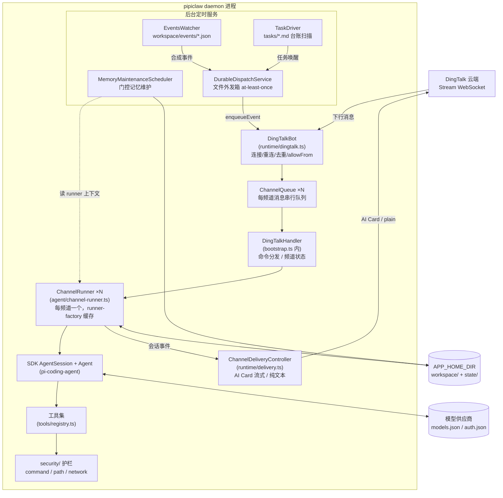
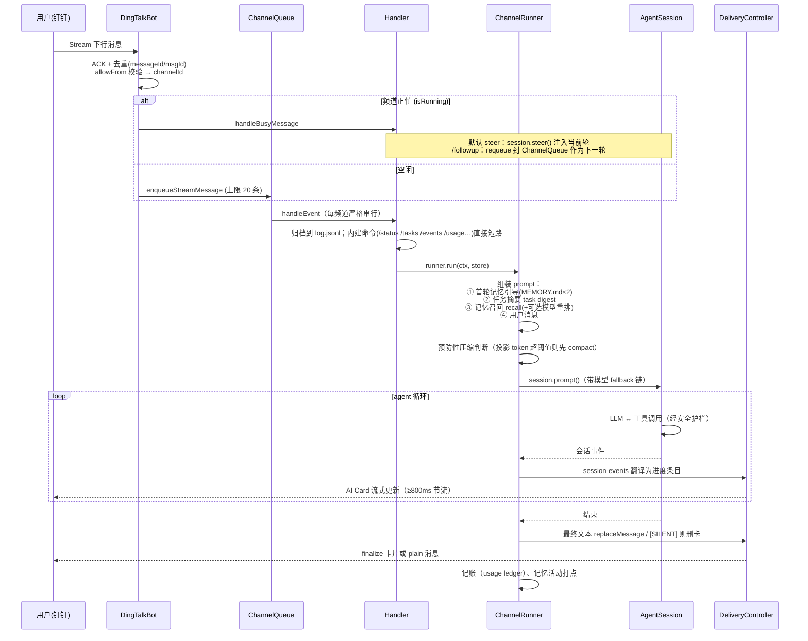
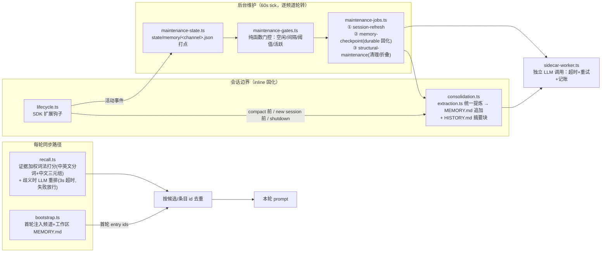
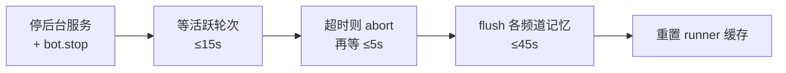

# Pipiclaw 架构

> **读者**：要改这份代码的人。
> **前置**：能跑起来项目；域边界与工程规则见 [../AGENTS.md](../AGENTS.md)。
> **读完你能**：定位任一子系统的代码位置，并说清一条消息从收到到回复经过了什么。
>
> 本文基于 v0.9.0 beta 当前实现整理，描述“代码现在是什么样”，而非设计愿景。各子系统的历史取舍见 `docs/specs/NNN-*`；配置细节见 [configuration.md](./configuration.md)。版本行为变化后应同步更新本文，不能把历史 spec 当作当前架构说明。

## 1. 定位与总体形态

Pipiclaw 是一个**钉钉优先、可长期运行的 AI coding assistant runtime**，个人和团队都可以使用。它包装 `@earendil-works/pi-coding-agent` SDK（`@mariozechner/pi-coding-agent` 的 fork），把一个 coding agent 挂到钉钉（DingTalk Stream 模式）上，并补齐长期运行所需的外围系统——按频道隔离的会话与记忆、定时事件、持久任务、子代理、安全护栏、用量账本。同一套 agent 内核还有第二个传输前端：终端 TUI。

```
pipiclaw            # 默认：长驻钉钉 daemon（等价 pipiclaw run）
pipiclaw tui [提示] # 终端聊天，同一 agent 内核，无需钉钉凭据
```

核心设计取向（从实现中反推出来的一致性原则）：

| 原则 | 体现 |
|---|---|
| **频道（channel）是隔离单元** | 每个钉钉会话（`dm_<staffId>` / `group_<conversationId>`）拥有独立的 ChannelRunner、AgentSession、记忆文件、任务台账、串行队列 |
| **一切串行化都显式建模** | 消息队列、投递队列、记忆写队列各司其职（见 §5），共享文件用 write-temp-then-rename 原子写 |
| **传输层与 agent 层解耦** | Runner 只依赖 `ChannelContext` 投递契约，不知道钉钉存在；TUI 是第二个实现 |
| **状态全部落在仓库外** | 配置、工作区、记忆、任务、日志都在 `APP_HOME_DIR`（`~/.pipiclaw`，可用 `PIPICLAW_HOME` 覆盖） |
| **后台工作是"扫描 + 门控"** | 记忆维护、任务驱动都是定时 tick + 确定性 gate，LLM 只在 gate 放行后才被调用 |

## 2. 源码地图

| 目录 | 职责 | 关键文件 |
|---|---|---|
| `src/runtime/` | 钉钉传输、后台服务与装配根 | `bootstrap.ts`（装配根）、`dingtalk.ts`（传输）、`delivery.ts`（投递控制器）、`events.ts`、`task-driver.ts`、`durable-dispatch.ts` |
| `src/channel/` | 传输中立的「频道」域：两个 I/O 契约、身份与持久状态。不依赖任何传输 | `channel-context.ts`（出站投递端口）、`channel-event.ts`（入站事件形状）、`channel-paths.ts`、`channel-index.ts`、`store.ts`、`active-session-store.ts`、`project-scope-store.ts` |
| `src/agent/` | 单频道 agent 编排：组装 SDK 会话、跑一轮、流式回传 | `channel-runner.ts`（核心编排器）、`session-events.ts`、`prompt/`（system prompt 流水线）、`model-fallback.ts` |
| `src/commands/` | 全产品斜杠命令目录与共享回复预算；零 import，命令处理器仍留在各自的状态所有者层 | `catalog.ts`、`reply-limits.ts` |
| `src/memory/` | 分层记忆子系统：召回、固化、门控维护流水线 | `lifecycle.ts`、`recall.ts`、`extraction.ts`、`consolidation.ts`、`scheduler.ts`、`maintenance-{jobs,gates,state}.ts`、`sidecar-worker.ts` |
| `src/tools/` | 交给 agent 的工具集，单一声明式注册表 | `registry.ts`（唯一事实源）、各 `create*Tool` |
| `src/security/` | 所有工具共用的三道护栏 + 审计日志 | `command-guard.ts`、`path-guard.ts`、`network.ts`、`logger.ts` |
| `src/subagents/` | 子代理发现、run 生命周期（内置+外部统一）、workspace 写锁、外部 harness 适配器 | `discovery.ts`、`tool.ts`、`runs.ts`、`workspace-lease.ts`、`external/`（`harness.ts`、`run.ts`、`codex-cli.ts`、`claude-code.ts`、`exec.ts`） |
| `src/tasks/` + `src/shared/task-ledger.ts` | 持久任务的控制块、验证、存储 | `control.ts`、`store.ts`、`verification.ts` |
| `src/runtime/events.ts` + `src/tools/event-manage.ts` | 定时/传感器事件 | — |
| `src/tui/` | 终端前端（第二个 `ChannelContext` 实现） | `cli.ts`、`app.ts`、`turn-controller.ts` |
| `src/web/` | web_search / web_fetch 的搜索供应商、抓取、正文提取、代理 | `search.ts`、`fetch.ts`、`extract.ts` |
| `src/usage/` | 用量/成本账本（JSONL） | `ledger.ts`、`render.ts` |
| `src/playbooks/` | 随包发布的只读运行时手册（agent 按需 read） | `catalog.ts` + `*.md` |
| `src/shared/` | 串行队列、原子写、JSONL appender 等基础件 | `serial-queue.ts`、`atomic-file.ts` |
| `src/paths.ts` | 所有磁盘路径的集中定义 | — |
| `src/main.ts` | 薄入口：`run`→daemon，`tui`→终端，`auth`→凭据管理 | — |
| `src/models/` | 模型/凭据运行时封装 + `pipiclaw auth` CLI | `utils.ts`（`createModelRuntime`）、`provider-login.ts`（传输中立编排）、`login-ui.ts`（readline 界面）、`auth-cli.ts` |

## 3. 运行时拓扑

`bootstrap()`（`src/runtime/bootstrap.ts`）是唯一的装配根：加载配置 → 初始化 `APP_HOME_DIR` → 构造下图所有组件并互相接线。前台是消息驱动的主链路，后台是四个定时服务。


```mermaid
flowchart TB
    DT[DingTalk 云端<br/>Stream WebSocket]

    subgraph daemon [pipiclaw daemon 进程]
        BOT["DingTalkBot<br/>(runtime/dingtalk.ts)<br/>连接/重连/去重/allowFrom"]
        CQ["ChannelQueue ×N<br/>每频道消息串行队列"]
        HANDLER["DingTalkHandler<br/>(bootstrap.ts 内)<br/>命令分发 / 频道状态"]
        RUNNER["ChannelRunner ×N<br/>(agent/channel-runner.ts)<br/>每频道一个，runner-factory 缓存"]
        SESSION["SDK AgentSession + Agent<br/>(pi-coding-agent)"]
        TOOLS["工具集<br/>(tools/registry.ts)"]
        SEC["security/ 护栏<br/>command / path / network"]
        DELIVERY["ChannelDeliveryController<br/>(runtime/delivery.ts)<br/>AI Card 流式 / 纯文本"]

        subgraph bg [后台定时服务]
            EW["EventsWatcher<br/>workspace/events/*.json"]
            TD["TaskDriver<br/>tasks/*.md 台账扫描"]
            MMS["MemoryMaintenanceScheduler<br/>门控记忆维护"]
            DD["DurableDispatchService<br/>文件外发箱 at-least-once"]
        end
    end

    LLM[(模型供应商<br/>models.json / auth.json)]
    FS[(APP_HOME_DIR<br/>workspace/ + state/)]

    DT -->|下行消息| BOT --> CQ --> HANDLER --> RUNNER --> SESSION
    SESSION --> TOOLS --> SEC
    SESSION <--> LLM
    RUNNER -->|会话事件| DELIVERY -->|AI Card / plain| DT
    EW -->|合成事件| DD
    TD -->|任务唤醒| DD
    DD -->|enqueueEvent| BOT
    MMS -.->|读 runner 上下文| RUNNER
    MMS --> FS
    RUNNER <--> FS
```

要点：

- **`DingTalkBot`** 负责连接稳定性（心跳 ping/pong、90s 超时强制重连、指数退避、双层消息去重、`allowFrom` 白名单）和 AI Card 的 HTTP 调用（创建、流式更新、finalize，均带 15s 超时）。
- **合成事件不直接进内存队列**：EventsWatcher 和 TaskDriver 产生的事件先写入 `DurableDispatchService`（`state/dispatch/*.json` 文件外发箱，15 分钟租约，30s 重扫），保证进程崩溃后 at-least-once 重放，然后才 `bot.enqueueEvent`。
- **ChannelRunner 按 `(appHomeDir, channelDir, channelId)` 缓存**（`runner-factory.ts` 中的进程级 Map），一个频道全程复用同一个 SDK 会话。
- **委派 run 不属于 ChannelQueue 中的一轮**：内置 run 超过同步宽限后、以及所有外部 run，都会由 `SubAgentRunManager` 跨回合管理。外部 harness 启动 detached 进程，产物落到频道目录；完成后同样先经过 durable dispatch 再唤醒频道。

## 4. 一条消息的生命周期


```mermaid
sequenceDiagram
    participant U as 用户(钉钉)
    participant B as DingTalkBot
    participant Q as ChannelQueue
    participant H as Handler
    participant R as ChannelRunner
    participant S as AgentSession
    participant D as DeliveryController

    U->>B: Stream 下行消息
    B->>B: ACK + 去重(messageId/msgId)<br/>allowFrom 校验 → channelId
    alt 频道正忙 (isRunning)
        B->>H: handleBusyMessage
        Note over H,S: 默认 steer：session.steer() 注入当前轮<br/>/followup：requeue 到 ChannelQueue 作为下一轮
    else 空闲
        B->>Q: enqueueStreamMessage (上限 20 条)
    end
    Q->>H: handleEvent（每频道严格串行）
    H->>H: 归档到 log.jsonl；内建命令(/status /tasks /events /usage…)直接短路
    H->>R: runner.run(ctx, store)
    R->>R: 组装 prompt：<br/>① 首轮记忆引导(MEMORY.md×2)<br/>② 任务摘要 task digest<br/>③ 记忆召回 recall(+可选模型重排)<br/>④ 用户消息
    R->>R: 预防性压缩判断（投影 token 超阈值则先 compact）
    R->>S: session.prompt()（带模型 fallback 链）
    loop agent 循环
        S->>S: LLM ↔ 工具调用（经安全护栏）
        S-->>R: 会话事件
        R->>D: session-events 翻译为进度条目
        D-->>U: AI Card 流式更新（≥800ms 节流）
    end
    S-->>R: 结束
    R->>D: 最终文本 replaceMessage / [SILENT] 则删卡
    D-->>U: finalize 卡片或 plain 消息
    R->>R: 记账（usage ledger）、记忆活动打点
```

细节补充：

- **忙时语义**：任务流式进行中，内建命令（`/help /stop /steer /followup /events /tasks /status /usage /context /subagents`）仍可用；普通消息按 `busyMessageDefault`（默认 `steer`）注入当前轮；`/stop` 会中止当前轮、丢弃排队消息、暂停关联任务并取消 durable-dispatch 租约——但**不再**连带终止已派发的委派 run（spec 040），停止一个 run 需要显式 `/subagents cancel <runId>`；回执会指名被暂停的任务和 `/tasks resume <id>`，避免用户以为只是打断了一轮。`/new` 是例外，会绕过 busy 检查和旧 channel queue，立即提交新会话边界；其他会话命令（`/model` `/compact` `/session`）只在空闲时可用。
- **未知斜杠命令在分发处拒绝**（`isKnownSlashCommand`），避免 `/modle` 这类笔误消耗一整轮 LLM。
- **模型 fallback**（`agent/model-fallback.ts`）：主模型失败 → 切到 `settings.json` 配置的备用模型重试并通知用户；主模型进入冷却期（`PRIMARY_COOLDOWN_MS`），下一轮开始时若冷却期已过则静默切回。
- **超长输入**截断到 `MAX_USER_MESSAGE_CHARS` 并提示；`PIPICLAW_DEBUG=1` 时每轮完整 prompt 落到频道目录 `last_prompt.json`。

### 投递层（ChannelContext）

`channel/channel-context.ts` 定义传输无关的投递契约；Runner 与 session-events 只依赖这个接口。

| responseMode（channel.json） | 进度展示 | 最终回复 |
|---|---|---|
| `full_progress_then_plain_final`（默认） | AI Card 累积全部进度 | 卡片收尾 + plain 消息 |
| `rolling_progress_then_plain_final` | 卡片滚动窗口（常驻首行 `⏱ 用时 · N 步` + 最近 3 段） | 同上 |
| `final_card_only` | 无进度 | 仅最终卡片 |

后台唤醒（TASK_DRIVER / JOB / EVENT 三类合成事件）不受上表约束：`handleEvent` 给它们的 `ChannelContext` 传 `progressStyle: "none"`，因此不建卡、不推思考流、`[SILENT]` 收尾也没有卡片要删；最终答案仍按 `finalDelivery` 正常投递。用户消息不受影响。

`ChannelDeliveryController` 维护 revision 计数的同步循环：进度更新合并、≥800ms 节流、卡片预热（`primeCard`）、失败时降级 plain、`flush()` 有 60s 兜底死线保证 `run()` 的 finally 不会永久挂起频道。

## 5. 并发模型：谁在串行化什么

这是跨文件的关键不变量，改动任何一处前先对照此表。

| 队列 | 位置 | 串行化对象 | 粒度 |
|---|---|---|---|
| `ChannelQueue` | `runtime/channel-queue.ts`（由 dingtalk 传输消费） | **轮次**：一个频道同时只处理一条消息，后续消息排队（用户消息上限 20、事件上限 5） | 每频道 |
| `RunQueue`（`createRunQueue`） | `agent/run-queue.ts` | **一轮之内的出站投递调用**：进度/通知按序发往钉钉 API，错误只记日志不打断轮次 | 每轮 |
| `ChannelMemoryQueue` | `memory/channel-maintenance-queue.ts` | **同一频道的记忆写**：inline 固化（lifecycle）与后台维护（maintenance-jobs）共用**进程级单例**，绝不能各自内联，否则两条路径会争写同一批记忆文件 | 每频道（跨子系统共享） |
| `sessionRefreshQueue` | `memory/lifecycle.ts` | SESSION.md 刷新 | 每频道 |
| `ChannelStore.writeQueue` | `channel/store.ts` | `log.jsonl` 追加与轮转 | 每频道 |
| `DurableDispatchService.queue` | `runtime/durable-dispatch.ts` | 外发箱记录的读写 | 每记录 id |
| `SubAgentRunManager.queue` | `subagents/runs.ts` | 一个 run 的 register/settle/cancel：保证结算、记账、唤醒各只发生一次（三个幂等标记见下） | 每 runId（manager 本身每频道一个单例） |
| `writeFileAtomically` | `shared/atomic-file.ts` | 配置/状态文件：写临时文件再 rename | 每次写 |

另外两个互斥点：`SessionResourceGate`（`agent/session-resource-gate.ts`）让"资源热重载"与"prompt 进行中"互斥；`DingTalkBot` 内卡片创建和 access token 刷新都做了 singleflight 合并；`subagents/workspace-lease.ts` 是进程级的排他写锁（不是队列，没有等待语义），只有 `mutates: write` 的委派 run 会取它，key 是工作目录的 realpath，父子目录也算冲突——第二个写入者直接被拒绝，不是排队。

**委派 run 的生命周期不受 `ChannelQueue`/轮次状态机约束**：内置子代理超过 120s（或外部委派一开始）就从"这一轮的一部分"变成"跨轮存活的后台工作"，由 `SubAgentRunManager` 统一管理，通过 `DurableDispatchService` 完成时唤醒频道——与后台 job 是同一条唤醒管线，`/stop` 不再连带终止它（需要 `subagent_run op=cancel` 或 `/subagents cancel`）。

**忙态的单一所有者是 Runner 的轮次状态机**（`agent/types.ts` 的 `TurnPhase`：`idle → dispatching → preparing → streaming → finishing`）。传输层在派发消息的同一 tick 内同步调用 `runner.beginTurn()`、结束后 `endTurn()`；钉钉的忙时路由、TUI 的轮次控制、调度器的 `isChannelActive`、`/status` 全部从 `runner.isBusy()/getTurnStatus()` 派生，不再各持一份 flag。steer 窗口判断也单点化在 runner 的 `assertBusyWindowOpen`。

## 6. 记忆子系统（`src/memory/`）

分层结构，**不要摊平**——每层有独立职责与独立测试。

### 6.1 每频道的记忆文件

| 文件 | 内容 | 写入者 | 是否预载入上下文 |
|---|---|---|---|
| `SESSION.md` | 当前工作状态（标题/意图/活动文件/决策/约束/纠错/下一步/工作日志） | 运行时刷新（LLM sidecar） | 否，按需 read |
| `MEMORY.md` | 持久事实、决策、偏好（条目带 `<!--id:m-xxxx-->`） | 固化流程追加；首轮引导注入 | 首轮引导注入一次 |
| `HISTORY.md` | 折叠后的较旧历史摘要块 | 固化流程追加/折叠 | 否 |
| `log.jsonl` / `context.jsonl` | 冷存储：完整消息日志 / SDK 会话树 | ChannelStore / SessionManager | 否，`session_search` 工具检索 |
| `.memory/entries.json` | MEMORY 条目 metadata、来源 entry ids、状态与召回统计 | files/recall | 否，可从 `MEMORY.md` 重建 |
| `.memory/tombstones.jsonl` | 已遗忘条目的 id/hash（不含原文），防止自动复活 | memory_forget/files | 否 |
| `.memory-backups/` | 记忆文件最近 5 份备份 | files.ts | — |

工作区级还有管理员维护的 `workspace/MEMORY.md`（跨频道共享背景）与 `ENVIRONMENT.md`（机器事实）。系统提示词明确禁止 agent 用文件工具直接编辑频道 SESSION/MEMORY/HISTORY——只能走运行时串行化的维护路径或 `memory_save` / `memory_forget` 工具。

### 6.2 记忆的进与出


```mermaid
flowchart LR
    subgraph turn [每轮同步路径]
        RECALL["recall.ts<br/>证据加权词法打分(中英文分词+中文三元组)<br/>+ 歧义时 LLM 重排(3s 超时,失败放行)"]
        BOOT["bootstrap.ts<br/>首轮注入频道+工作区 MEMORY.md"]
    end

    subgraph boundary [会话边界（inline 固化）]
        LC["lifecycle.ts<br/>SDK 扩展钩子"]
        CONS["consolidation.ts<br/>extraction.ts 统一提炼 → MEMORY.md 追加<br/>+ HISTORY.md 摘要块"]
    end

    subgraph sched [后台维护（60s tick，逐频道轮转）]
        GATES["maintenance-gates.ts<br/>纯函数门控：空闲/间隔/阈值/活跃"]
        JOBS["maintenance-jobs.ts<br/>① session-refresh<br/>② memory-checkpoint(durable 固化)<br/>③ structural-maintenance(清理/折叠)"]
        STATE["maintenance-state.ts<br/>state/memory/&lt;channel&gt;.json 打点"]
    end

    SIDE["sidecar-worker.ts<br/>独立 LLM 调用：超时+重试+记账"]

    BOOT -->|首轮 entry ids| DEDUPE[按候选/条目 id 去重]
    RECALL --> DEDUPE --> PROMPT[本轮 prompt]
    LC -->|compact 前 / new session 前 / shutdown| CONS
    GATES --> JOBS --> CONS
    JOBS --> SIDE
    CONS --> SIDE
    LC -->|活动事件| STATE --> GATES
```

- **入口（读）**：channel `MEMORY.md` 按 bullet/entry id 构造候选；每轮把召回结果包在 `<memory>` 类前缀里注入 prompt。首轮 bootstrap 先声明已注入的 entry ids，recall 排除这些候选，避免重复上下文；bootstrap pending 只在 prompt 确认提交后清除。recall 只读一次 `.memory/entries.json` 做打分与 `recordMemoryRecall` 计数，不再对它做全量 reconcile——reconcile 是写路径（`applyChannelMemoryOps`/`rewriteChannelMemory`/`/memory` 命令）各自的职责，读路径用一份可能滞后的候选快照去 reconcile 正是 metadata 与 `MEMORY.md` 出现漂移的根源。`syncMemoryMetadata` 计算结果与磁盘已有内容字节相同时也跳过原子写，读多写少的召回热路径不再每轮都触发一次 `entries.json` 落盘。
- **召回打分是"证据制"而非"覆盖率制"**：候选按匹配到的 query token 的**特异性质量**累加计分（token 越长、越罕见、越非停用词，权重越高；再按候选集内的文档频率轻度衰减），达到绝对阈值即入围。刻意**不按 query 长度归一**——早期实现用"命中 token 数 / query token 数"做门槛，导致用户消息越详细召回越少（一条 60 token 的提问即使点名了记忆主题也过不了 25% 覆盖率门槛）。中文额外发射三元组，让"包管理器"这类被贪心分词打散的复合词仍能整体匹配。
- **召回宽、重排窄**：词法层负责不漏（宽入围），LLM 重排只负责裁剪。重排仅在入围数超过 `maxInjected` **且**本地排序不存在明显赢家时触发，3s 超时且失败即放行到本地排序——它在每轮的关键路径上，只能减少上下文，不能补救漏召回。重排选出空集合时不再直接返回空（那会把"重排过度谨慎"和"真的无关"混为一谈），而是保底返回本地排序第一名——shortlist 本身已经过了词法证据门槛，宁可多带一条可能无关的候选，也不要让本轮记忆整体清零。
- **弱查询借用上一轮**（`findPreviousUserText` + `RecallRequest.contextQuery`）：纯指代型追问（"上次说的那个安排，代号是什么来着？"）自身的 token 打不到任何候选的证据门槛。只有当当前 query 自己一个候选都选不出来时，才会把上一轮用户消息（经 `stripInjectedMemoryContext` 剥离注入的 `<runtime_context>`/`<user_message>` 包装，避免召回自己召回过的内容）拼进去重新打分一次；只影响打分，不进 prompt 也不进召回指纹。当前 query 自己就能命中时这条路径完全不触发，零副作用。
- **召回统计影响排序，但只是决胜局裁判**：`recallCount`/`queryFingerprints`（去重后的不同问法数，比原始次数更能代表"这事被反复问到"）、`necessity`（沿用提炼时打的 high/medium/low 标签，落盘进 `.memory/entries.json`）叠加成一个上限 +6 的小幅加成，agent 学到但超过 90 天没被召回过的条目再扣 2 分（用户明说要记的条目不受此惩罚）。整体只占结构分乘数的 10% 上限——词法证据仍然决定谁能入围，这只决定入围之后谁排前面。
- **出口（写）**：固化只发生在明确边界——压缩前、`/new` 前（后台异步、快照先行）、关机 flush、以及后台维护 job。每次固化写 `review-log`（可审计）。
- **`memory_save` 的冲突检测**：写入前复用 `memory_search` 同一条召回管道（`rerankWithModel: false`，确定性点查）查一遍频道已有记忆；命中一条分数达到高置信阈值的相似条目就不写入，转而报一个 `RecoverableToolError` 列出冲突条目 id，要求模型带上 `supersedes`（目标 id 或 `"none"`）重新调用。第二次调用必定执行，不会死循环。这把"改主意时先说'忘掉旧的'"从用户操作规程收窄成模型自己就能处理的纠正回路。
- **只有一条提炼路径**（`extraction.ts`）：边界固化与空闲 checkpoint 共用同一个 prompt、同一份 JSON schema、同一套两档置信度闸门（`classifyMemoryWrite`，spec 037 D6）。此前多条路径各写各的 prompt，其中有的完全不设置信度门槛，于是 `MEMORY.md` 的质量由最不严谨的那条决定。调用方仍各自负责副作用：只有边界写 `HISTORY.md`。被闸门拒绝的候选不会静默消失——写进 `memory-review.jsonl` 的 `skipped`，且素材本身仍留在 `HISTORY.md` 与冷存储中。工具输出在 `sanitizeMessagesForMemory`（`transcript.ts`）就被剥离，是提炼输入的可信边界——`runMemoryExtraction` 看到的转写永远不含 `toolResult` 消息，因此不需要在窗口层再叠加一道"是否含工具输出"的过滤（2026-08-24 修复：曾经的窗口级过滤会连带封杀同窗口内 assistant 自己写下的可信内容，导致含工具调用的对话全部无法写入长期记忆）。
- **提炼 prompt 里的现有条目列表按频道大小分流**：条目数 ≤40 时照旧全量渲染；超过 40 条时改成本地词法重叠打分（复用 `recall.ts` 的分词器，不拉起整条 recall 管道），只渲染与本次对话最相关的 top-20，加上全部 `sourceType: "user"` 的条目（用户明说要记的事实必须始终是 supersede 候选，不受相关性排序影响），并在 prompt 里注明"仅展示部分条目"。条目一多，供模型判断该 supersede 谁的输入本来就会被 8000 字符的裁剪吃掉尾部，相关性优先渲染让模型至少看到的是与本轮相关的那部分。
- **两档写入 + 试用期**（spec 037）：`necessity: high` 且 `confidence ≥ 0.85` 永久写入（与此前一致）；`necessity: medium` 且 `confidence ≥ 0.9` 以 30 天试用期写入（`metadata.probationUntil`，每次固化最多 5 条），只对 `add` 生效——`supersede`/`invalidate` 永远要求永久档，避免覆盖/删除操作本身过期后复活旧内容。试用期条目在被召回一次（`recordMemoryRecall`）、被重复 add 命中（`applyChannelMemoryOps` 的 `skippedDuplicate` 分支）、或被永久 supersede 替换时转正；从未转正的条目由 `structural-maintenance` job 里的确定性前置步骤（`probation.ts`）用 `invalidate`（不是 `forget`）清理——不留墓碑，同一事实之后仍可被重新学到。
- **调度器**（`scheduler.ts`）每 tick 轮转选取不活跃频道（`maxConcurrentChannels` 上限），三个 job 按优先级依次尝试，**先跑成一个就停**；每个 job 先过各自的确定性 gate（空闲时长、距上次运行间隔、素材是否有意义、夜间窗口等），gate 不放行则零 LLM 成本。频道上下文的取法：本次启动说过话的频道复用其 Runner 内存态；其余频道走 `agent/maintenance-context.ts` 的**磁盘冷上下文**（SessionManager 直读 context.jsonl + mtime/size 缓存），不会为历史频道复活完整 Runner。
- **sidecar**（`sidecar-worker.ts`）是所有记忆 LLM 工作的统一出口：独立的 `Agent` 实例、超时、最多 2 次尝试、JSON 解析校验、用量记入账本（kind=`sidecar`）。记忆 source window、usage ledger 与 review log 共用 correlation id，可把成本关联到本次维护结果；重复的纯 gate-skip 审计会合并降噪。

## 7. 持久任务与定时事件

两套互补机制，都以文件为事实源、经 durable-dispatch 唤醒频道：

| | 定时事件 Events | 持久任务 Tasks |
|---|---|---|
| 事实源 | `workspace/events/<name>.json` | `workspace/<channelId>/tasks/<id>.md`（frontmatter 契约） |
| 类型 | `one-shot`（ISO 时刻） / `periodic`（cron 按主机时区，croner 库） | `active / waiting / sleeping` 三态 + 独立 `enabled`；归档记录 `completed / cancelled` |
| 驱动者 | `EventsWatcher`：fs.watch + 防抖，cron 到点触发 | `TaskDriver`：自适应 timer + nudge 扫描台账，每频道每 tick 至多唤醒 1 个可行动任务 |
| 前置条件 | `preAction`（bash，经 command-guard 审查，退出码非 0 则跳过本次触发——"传感器"模式） | `wake` 时刻、fingerprint 未变化时按 stalled 间隔退避 |
| 治理 | 事件历史 `state/events/history.jsonl` | 确定性 governor：active attempt budget / deadline 或连续无进展 → `enabled=false` + `stop(by=governor)`，直接通知 |
| Agent 侧工具 | `event_manage` | `task_create`/`task_update`/`task_close`/`task_verify`/`task_list`，配合 `task-planning` / `task-driving` playbook |
| 用户命令 | `/events` | `/tasks`（pause/resume/run/set/doctor 等零 LLM 成本控制） |

TaskDriver 派发的是一条合成消息 `[TASK_DRIVER:<id>] Resume task …`（带任务胶囊摘要），走与用户消息完全相同的串行轮次管道；轮次结束后把 usage/耗时回写任务控制块（`finishTaskAttempt`）。整套任务机制（全部 task_* 工具、TaskDriver、任务摘要注入）由 `tools.json` 的 `tools.tasks.enabled` 一个总开关门控。

任务正文可选携带一段 `## Plan`（spec 037）：介于 Goal/DoD 契约与只增的 Current Cycle 日志之间的手段层，四态 checkbox（`[ ]`/`[x]`/`[!]`/`[~]`），当前步骤由 runtime 从文档顺序推导、不由模型自报，唤醒胶囊与任务摘要都会显示进度和当前步骤。契约段哈希的边界因此改为「Plan 与 Current Cycle 中先出现的那个」，使 Plan 步骤状态变化永不影响已记录的验证 PASS。Plan 状态刻意不进入 TaskDriver 的停滞 fingerprint——勾一个复选框不能重置连续无进展计数、买到快速重试档。

## 8. 工具层与子代理

`tools/registry.ts` 的 `TOOL_REGISTRY` 是**叶子工具的唯一事实源**：主工具集、子代理工具集、系统提示词里的工具索引都从它生成。

| 工具 | 子代理可用 | 配置门 (`tools.json`) |
|---|---|---|
| `read` / `bash` / `edit` / `write` / `grep` / `glob` | ✅ | 恒开，无开关 |
| `web_search` / `web_fetch` | ✅ | `tools.web.enable`（默认关；Brave 搜索 + Readability 正文提取，支持代理） |
| `session_search` / `memory_save` / `memory_search` / `memory_forget` / `skill` / `event_manage` / `job` | ❌ | 恒开，无开关（核心能力） |
| `send_media` | ❌ | 无配置开关；由传输能力决定——仅当驱动的 transport 提供了 `MediaSender`（钉钉机器人或终端）时才构建并进入工具索引 |
| `task_list`/`task_create`/`task_update`/`task_close`/`task_verify` | ❌ | `tools.tasks.enabled`——**自主长程任务总开关**，同时门控 TaskDriver 与每回合任务摘要 |
| `subagent` / `subagent_list` / `subagent_run` | ❌（防递归） | 注册表之外单独追加（避免 registry↔subagents 循环依赖） |

工具的调用面按 payload 形状切分：**形状不同就拆，形状相同就合**（spec 046/047）。`op` 枚举的路由散文把每条分支各讲一遍，是真正的 token 成本——所以任务族是五个工具而非一个 `action` 分发工具，记忆是 `memory_save` / `memory_search` / `memory_forget`，委派控制是 `subagent_list` + `subagent_run`；而 `event_manage` 的 `create` / `update` 参数集完全相同，合在一个工具里。

增强类开关：`tools.rtk`（token 优化改写，默认关）、`tools.bashInterceptor`（把裸 `cat`/递归 grep/`sed -i` 导向专用工具，默认开）。

`write.ts` 是共享 `write-content.ts` 的薄包装（子代理工具也复用后者）——这个拆分是有意的。

**`FileStore`（`src/file-store.ts`，spec 044）与 `Executor` 并列**：文件内容工具（`read`/`edit`/`write`/`send_media`）走 `FileStore`，直接在 `node:fs` 流上读写；`Executor` 只服务真正的命令工具（`bash`/`grep`/`pdftotext`）。两者共享同一条 `guardPath` 解出的 `resolvedPath`——路径只解析一次，守卫判定的和实际打开的必然是同一个值。`edit` 在这条路径上做字节级 splice（不解码整份文件，大文件走两趟流式扫描+应用），从根本上避免了文件内容穿过 shell 捕获缓冲导致的截断/编码损坏。

**子代理 / 委派 run**（`subagents/`，spec 040 起内外统一）：角色定义在 `workspace/sub-agents/*.md`，`runtime` 字段区分 `internal`（默认，进程内隔离上下文子代理）与 `external`（一次性调用 claude-code / codex-cli / exec，argv 直连、不经过 shell），也支持调用时内联定义一个 internal 角色；Pipiclaw 不自动注入默认角色，二进制缺失的外部角色仍会列出并标 `unavailable`。内置硬约束：工具白名单仅 `read/grep/bash/edit/write/web_search/web_fetch`（默认 `read+bash`），默认限额 24 turns / 48 tool calls / 300s 墙钟；外部角色没有轮数/工具调用概念，只有 `maxWallTimeSec`（默认 1800s）。调用面（`subagent` 工具）内外共用同一 schema。

`subagents/runs.ts` 的 `SubAgentRunManager` 是每个 run 结算、记账、完成唤醒的唯一权威（内置外部都一样）：`register()` 持久化启动意图 → 结算一次（`settledAt`）→ 记一次账（`usageRecorded`）→ 唤醒一次（`wakeEnqueued`），三个幂等标记各守一个不可重放的副作用。工具调用只是**可选地**等一等——`min(角色 maxWallTimeSec, 120s)` 内结算完直接内联返回（`session-events.ts` 只把它折进当轮用量展示，不再自己记账/归档）；超过就转成"稍后唤醒"的异步返回，外部角色的这个宽限窗口恒为 0，一律异步。`subagent_list` / `subagent_run`（模型侧）与 `/subagents`（人侧，不经过模型）负责 `list`/`show`/`cancel`/`follow_up`。`purpose: verify` 时内置验证器仍结构性移除 write/edit；声明 `mutates: write` 的 verifier 也可运行，但必须持有独占 workspace lease，且 `verificationStrength: advisory`。新 attestation 的 subject 固定验证开始时的 `baseCommit`，并保留既有 untracked 路径；只对 checkout 根目录下明确临时产物范围内新出现的 untracked 文件放行，其他新源文件和既有 untracked 产品文件的修改仍由 subject 比对发现。旧 attestation 继续使用 HEAD-sensitive `workspaceSubjectHash` 兼容算法。

## 9. 安全层（`src/security/`）

Pipiclaw 自己的文件、命令和网络工具在执行前都过守卫；拦截写入审计日志（`security/logger.ts`）。事件 `preAction` 与 bash 工具共用同一 command-guard。

| 守卫 | 默认 | 机制 |
|---|---|---|
| `command-guard` | 开 | 规范化（去 null、NFKC、去注释）、按 shell 链拆分、分类规则匹配（危险命令、提权、防绕过） |
| `path-guard` | 开 | 拒绝敏感路径：私钥/凭据文件、`~/.ssh` `~/.aws` 等目录、系统目录写入、shell rc 文件写入、`/proc/*/mem` |
| `network-guard` | 关 | web 工具的 SSRF 防护：DNS 解析后校验，拦截 localhost/链路本地/私网 CIDR/云 metadata，重定向逐跳复查 |

其它硬化：六个可能含密钥的配置文件（`channel/auth/models/settings/tools/security.json`）创建即 0600，启动时对已存在的宽权限文件收紧；系统提示词层面还有"任务 scope 内的外部动作须遵守能力配置、幂等与审计"等常驻不变量（`agent/prompt/sections.ts`）。

外部智能体不使用上述工具实现，因此 command/path/network guard 不覆盖它。角色文件是授权面；`external/run.ts` 在 spawn 前严格写入 `external-agent` 审计事件，目标 CLI 的 sandbox 和宿主运行账号才是强隔离边界。`workspace/sub-agents/` 对模型的 write/edit 工具拒写，避免模型自行创建高权限角色，但通用 bash 仍是已知逃逸面。

## 10. 模型与用量

- **模型解析**：`models.json`（供应商/模型定义）+ `auth.json`（密钥）→ SDK `ModelRegistry`；启动时取 `settings.json` 保存的默认模型，否则第一个可用模型。`/model` 切换会重定义"主模型"并清空 fallback 状态。
- **用量账本**（`usage/ledger.ts`）：JSONL 落在 `state/usage/`，条目分 `turn`（主轮，只记 assistant 用量）/ `subagent`（内置外部委派 run，由 `subagents/runs.ts` 统一写入，只在结算时写一次）/ `sidecar` 三类，保证 Σ(条目) = 真实开销、无重复计数。条目带 `usageKnown`/`costKnown` 标记——`codex-cli` 不报成本、`exec` 连 token 都不报，`/usage` 展示"未知"而不是 0。`/usage` 命令渲染汇总。
- **上下文预算**（`agent/context-budget.ts`）：对"已组装完成的完整 prompt"（含召回/摘要/引导）估算 token，投影超过阈值先做预防性 compact，而不是等 SDK 撞墙。

## 11. 磁盘布局（`src/paths.ts` 集中定义）

```
~/.pipiclaw/                       # APP_HOME_DIR（PIPICLAW_HOME 可覆盖）
├── channel.json                   # 钉钉凭据 + busyMessageDefault/responseMode（0600）
├── auth.json / models.json        # 模型密钥 / 模型定义（0600）
├── settings.json                  # 运行时设置：模型、fallback、模块开关、日志级别（0600）
├── tools.json / security.json     # 工具开关 / 守卫开关（0600）
├── workspace/
│   ├── SOUL.md                    # 身份与语气（注入系统提示词最前）
│   ├── AGENTS.md                  # 用户/团队操作规则（经 SDK agentsFiles 注入）
│   ├── MEMORY.md / ENVIRONMENT.md # 管理员维护的共享背景 / 机器事实
│   ├── CHANNELS.md                # runtime 维护的频道索引（ID / 名称 / 最近消息 / 主题）
│   ├── skills/  sub-agents/  events/
│   └── <channelId>/               # dm_* / group_*，每频道一目录
│       ├── SESSION.md  MEMORY.md  HISTORY.md
│       ├── log.jsonl  context.jsonl  .channel-meta.json
│       ├── subagent-runs.jsonl     # 委派执行摘要
│       ├── subagent-artifacts/<runId>/ # output.md；外部 run 另含 prompt/events/stderr
│       └── tasks/<id>.md
└── state/
    ├── dispatch/                  # durable-dispatch 外发箱
    ├── events/history.jsonl       # 事件审计
    ├── jobs/<channelId>/          # 后台作业状态与输出索引
    ├── subagent-runs/<channelId>/ # 委派权威状态、pid、argv、幂等标记（目录名 `/` → `__`）
    ├── memory/<channelId>.json    # 记忆维护打点状态
    ├── logs/runtime.jsonl         # 结构化运行日志
    └── usage/                     # 用量账本
```

## 11.1 System prompt 流水线（spec 025 + 026 瘦身）

system prompt 由 Pipiclaw 自己拥有：`channel-runner.ts` 通过 pi 的 `systemPromptOverride` 注入 `src/agent/prompt/` 构建的结果，pi 的默认基础提示词（身份段、文档索引、失真的工具列表）不再发送。

组装顺序：

```text
runtime.identity → runtime.execution → runtime.invariants → runtime.tasks(需 task_create/task_update/task_close)
→ playbooks(按工具过滤) → subagents(需 subagent 且有条目) → SOUL.md → AGENTS.md
→ [pi 追加] <available_skills> + 当前日期 + cwd
→ [before_agent_start 追加] runtime.boundary footer
```

- **section 化**：每段声明 `order`/`authority`/`cacheClass`/`requiresTools`/预算/溢出策略（`prompt/types.ts`、`prompt/sections.ts`），builder 负责过滤、排序、预算和 fingerprint（`prompt/builder.ts`）。runtime 段超字符预算会产出 error 诊断（测试直接失败）。
- **瘦身与内容责任（spec 026）**：Pipiclaw 只为自己写下的固定段负责，且严格克制——不再重复 tool 目录（tool schema 已是权威），identity/contract/boundary 文案压缩，playbook 目录只保留 filename + 一句 trigger 并在头部打印一次绝对 `PLAYBOOKS_DIR`，无配置 sub-agent 时整段消失。当前 full-tools 下 runtime-authored ≈ 390 prompt units（旧基线 ~1047）。
- **prompt units 预算**：预算以 `countPromptUnits`（`shared/prompt-units.ts`：CJK 每字 1、非 CJK 单词 1、标点空白 0）度量。runtime-authored 段合计目标 ≤ 700 units、硬上限 1,200 units（`builder.ts`），超标分别 warning/error。已删除旧的 32k 全局字符池与「依次收缩 subagents/playbooks/AGENTS/SOUL」策略，用户文件不再因总量竞争被裁。`HARD_TOTAL_BUDGET_CHARS`/`SOFT_TOTAL_BUDGET_CHARS` 公共导出随之移除（beta API 变更）。
- **SOUL / AGENTS 独立预算**：两者互不挤压，各有 units + chars 双上限（SOUL 3,000 units / 24,000 chars，AGENTS 6,000 units / 48,000 chars，见 `prompt/resources.ts`）。只有真正超大的文件才 head/tail 截断；正文裁剪发生在 resources 层，section 层只保证 wrapper 完整。
- **缓存稳定**：system prompt 里没有 channelId、channel 路径、时间戳。同一 workspace 下不同频道、连续多轮的 prompt 字节一致，provider 前缀缓存才能命中。频道事实改由每回合的 `<runtime_turn_context>` 胶囊携带（`channel-runner.ts`）。
- **工具门控**：关闭 task_* 工具时，任务段、任务 playbook 一并消失；不包含 `subagent` 工具的执行上下文（例如被委派的内置子智能体）不会看到角色目录。注意两侧门控语义相反：section 的 `requiresAllTools` 是 all-of（`prompt/types.ts`），playbook 的 `requires-tools`/`requiresAnyTool` 是 any-of（`playbooks/catalog.ts`）。
- **skills 完全交给 pi（spec 026 §9）**：`skillsOverride` 保留 ResourceLoader 中的 skills，`<available_skills>` 索引与 `/skill:name` 命令同源；Pipiclaw 只负责合并策略与诊断（workspace 覆盖同名 skill），不设 skills 预算、不产生超限 warning。`/context` 只观测 skills 体量（`estimateSkillsPromptChars` 现位于 `prompt/manifest.ts`）。
- **场景化规则**：periodic wake 的 `[SILENT]` 协议只随 periodic 事件的 synthetic trigger 下发（`runtime/events.ts`），普通对话不再长期携带。TASK_DRIVER 的准确 task 文件与 playbook 路径继续由 `runtime/task-driver.ts` 的 trigger 给出。
- **自动 turn context 单位上限（spec 026 §5.3）**：recall（1,800 units）、task agenda（600 units）、first-turn bootstrap（400 units）各有独立 unit 上限，与 settings 的 char 上限「先到先裁」，按完整 item/section 丢弃并给出下一步（`memory/recall.ts`、`memory/task-digest.ts`、`memory/bootstrap.ts`）。
- **可观测**：`/context`（及 `/context detail`，忙碌时也可用）零 LLM 成本地列出各 section 的 units/chars、runtime-authored 合计、SOUL/AGENTS 独立预算、skills 归属和上一轮自动上下文 units；`PIPICLAW_DEBUG=1` 时 `last_prompt.json` 记录**实际发出的** system prompt 与 manifest。注意 `fingerprint` 只覆盖 Pipiclaw 自有 section（日志据此去重），provider 真正缓存的是含 pi tail 的整串，即 `finalPromptSha256`——date 每日一变会让整块 system prompt 重算。缓存效果结合用量账本里的 cacheRead/cacheWrite 观察。

playbook 正文不进提示词，agent 触发时用 `read` 按需加载。

## 12. 启动与关闭

**启动**（`bootstrap()`）：解析参数 → 初始化 app home（缺失文件按模板生成；首次生成 `channel.json` 模板则提示填写后退出）→ 校验钉钉配置 → 加载 settings/tools/security 并输出诊断 → `createRuntimeContext` 装配全部组件 → 启动四个后台服务和 bot 连接。

**关闭**（SIGINT/SIGTERM/manual，幂等）：


```mermaid
flowchart LR
    A[停后台服务<br/>+ bot.stop] --> B[等活跃轮次<br/>≤15s] --> C[超时则 abort<br/>再等 ≤5s] --> D[flush 各频道记忆<br/>≤45s] --> E[重置 runner 缓存]
```

关机 flush 用比平时更宽松的 gate：只要有未固化的持久活动（哪怕没有完整 assistant 轮）就做最后一次固化——这是最后的持久化机会。

**第三个入口——`pipiclaw auth`（spec 039）**：`daemon`/`tui` 都会走上面这套 `bootstrap`/`runtime` 装配，`auth` 不会。`pipiclaw auth status|login|logout`（`src/models/auth-cli.ts`）只做 `bootstrapAppHome` + `prepareAppServices` + `createModelRuntime`，不构造 runner、session、记忆调度器或频道目录——它是一个短进程、一次性的凭据运维操作，登录成功后需要重启正在跑的 daemon/TUI 才能看到新凭据（`AuthStorage` 把 auth.json 读进内存快照，只有 `modify`/`delete` 才重新读盘）。钉钉端不提供登录入口，TUI 当前也不内嵌登录流程，详见 `docs/specs/039-provider-login-cli/design.md`。

## 12.1 公共 API 面（`src/index.ts`，spec 035）

Pipiclaw 的产品是 CLI/runtime，不是 SDK。`src/index.ts` 因此只支持**一种**用法——把 daemon 嵌进别的进程——并且只为这一种承诺稳定：`bootstrap` 及其选项/结果类型、`DingTalkBot` 与其配置类型、`ChannelContext` 投递契约、`paths.ts` 的路径常量、`PipiclawSettings` 类型。

其余全部是内部实现，从各自模块导入并且随时可能移动。这条界线有具体的工程理由：`src/index.ts` 是 `knip.json` 的 entry point，**每个从这里导出的名字都是一处死代码检测盲区**。0.8.11 之前 barrel 有约 90 个名字，`npm run deadcode` 对其中大部分形同虚设。同理，`prompt` 预算常量的公共导出此前也已移除（beta API 变更）。

## 13. 测试与质量门

- `npm run check` = Biome lint + `tsc --noEmit` + knip 死代码 + Vitest 单测；`npm run test:e2e` 单独跑真实 bootstrap 的端到端套件。
- 记忆流水线的每个单元（lifecycle/gates/jobs/state/recall/consolidation）都有独立测试文件，这是"分层不摊平"原则的另一面。
- 领域边界与工程规则的权威描述在 `AGENTS.md`；每个子系统的设计脉络在 `docs/specs/NNN-*`。
