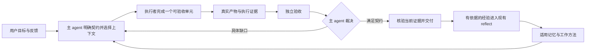

# 让 token 持续转化为可验收的产出

> 2026-09-06，基于源码 `9b92ab8`、当前 playbook、示例角色与 evals 的优化建议。
>
> **实施进度（2026-09-07）**：第一批四项机制修复与第二批 playbook 改写已落地，`npm run check` 与 `npm run test:e2e` 通过；修复前对应回归确认能失败。第三批按本文自己的门槛保留——还没有真实失败样本。§10 记录了每项的实际结果。评估（§9.2）与对照实验尚未运行，那需要付费模型。

Pipiclaw 下一阶段最值得投资的是：**让主 agent 更可靠地把用户意图变成工作契约，把适用知识带到每次委派，把证据变成下一轮决策，再把验证过的经验带到下一项工作。**

现有 task、run、等待票、独立验收、记忆索引、reflect 和 playbook 已经足够承载这条链路。先修复链路上的断点，再改善工作方法；增加组件必须有真实失败案例作为依据。

## 1. 优化目标：单位注意力获得的有效交付

“高效消耗 token”应当理解为：在可接受的费用和时间内，让算力持续推进用户真正需要的结果。

有效交付同时满足三个条件：目标成立、证据充分、符合用户适用的工作要求。`done`、PASS、代码行数、委派次数和工具调用次数都不能单独替代它。重构了很多代码但扩大了维护负担，或测试通过但漏了用户要求，都要算返工。

建议每周只看四组数字，复用现有日志和 usage，先生成一份 Markdown 报告即可：

| 指标 | 怎样记录 | 防止误读 |
|---|---|---|
| 有效交付率 | 同类任务中通过验收并交付、在约定观察期内没有因遗漏要求而返工的比例 | 运行时关闭只是候选完成；用户未反馈不能自动当作认可 |
| 人工介入 | 每项工作的必要决策、补上下文、纠错分别计数；抽样记录实际耗时 | 必要授权和可避免的追问分开，不能靠少问但做错来美化指标 |
| 总成本 | 同批工作的主 agent、执行、验收、失败尝试、记忆维护费用 | 把失败成本一起计入；实报与估算分开；不能只统计成功 run |
| 交付时间 | 同类工作的中位数和较慢案例，区分工作耗时与等人/等外部系统 | 不把停车等待误判为执行低效，也不把快速交付低质量结果算优化 |

还有一个很有价值的抽样问题：**同一条用户要求，这个月是否被重复解释或纠正？** 它能直接检查“记住了”是否转化成“会照着做”。

本次没有读取实际部署的近期任务轨迹，不能据源码判断哪一类原因占比最高，也不承诺提高多少成功率。下面把已确认的机制问题与需要评估的行为假设分开。

## 2. 现状：基础足够，交接存在具体缺口

值得保留的基础包括：任务独立 session、`resolveTicket`/`redeemTicket`、`SubAgentRunManager` 的唯一结算所有权、artifact 持久化、验收 attestation、四维预算、记忆按频道隔离，以及 playbook 正文按需加载。详细行为继续以[事件与任务](../events-and-tasks.md)、[委派](../sub-agents.md)、[记忆](../memory.md)及源码为准。

| 发现 | 证据与确定程度 | 对生产力的影响 |
|---|---|---|
| **最终关闭没有重新核验 PASS 的有效性** | [`step-end.ts`](../../src/tools/task-manage/step-end.ts)、[`lifecycle.ts`](../../src/tools/task-manage/lifecycle.ts) 都只调用 [`hasPassingRound`](../../src/tasks/rounds.ts)，判断本周期是否曾有 PASS；真正的 hash 检查在结算阶段。已用临时数据复现 | PASS 后改了目标或产物，关闭入口仍可能放行；直接损害交付可信度 |
| **记忆清洗遗漏当前注入块** | [`render.ts`](../../src/memory/render.ts) 输出 `<memory_bootstrap>`；[`transcript.ts`](../../src/memory/transcript.ts) 清洗正则仅包含旧记忆块等名称。已调用真实函数复现 | 已有记忆会进入“新对话”素材，有被重复总结、误判为再次确认的风险；实际误写频率尚未测量 |
| **委派指导与工具参数不一致** | [`agent-delegation.md`](../../src/playbooks/agent-delegation.md) 仍指导 `context: session/relevant`；[`tool.ts`](../../src/subagents/tool.ts) 的普通 `subagent` 没有该参数，inline 只支持 `none/index` | 模型即使照着指导做，也可能形成错误调用或错误的上下文继承预期 |
| **task/chat 切换重复重置记忆首轮标记** | [`bootstrap.ts`](../../src/runtime/bootstrap.ts) 每步绑定 task、结束后切回 chat；[`channel-runner.ts`](../../src/agent/channel-runner.ts) 两个绑定方法都将 `firstTurnMemoryBootstrapPending` 置为 true。源码路径已确认，尚未测量生产请求增量 | 同一 cycle 的下一步仍可能重复注入完整 bootstrap；“有独立会话”并不自动等于“只加载一次” |
| 上下文自动注入没有按本轮任务选择内容 | [`buildContextualBlocks`](../../src/subagents/tool.ts) 只读取角色配置与频道背景，不接收任务语义；`index` 注入 workspace memory、频道索引、当天 journal，角色策略相对固定 | `index` 提供背景，但不能代替逐次选择适用约束；普通委派的选择责任仍在主 agent 的 `task` 文本 |
| brief 更偏向按时间取记录 | [`brief.ts`](../../src/tasks/brief.ts) 给契约全文和最近 8 条日志；[`log.ts`](../../src/tasks/log.ts) 的 round 摘要主要是 verdict/runId，`reason` 用于 attestation 被拒原因 | 真正的产品失败原因可能要另读 `output.md`；“最近”不总等于“这一步最需要” |
| 任务成果进入学习的路径不确定 | [`reflect-job.ts`](../../src/memory/reflect-job.ts) 消费会话窗口；[`lifecycle.ts`](../../src/memory/lifecycle.ts) 普通 session switch 不触发 `/new` 反思；清洗还会去掉 tool result。目前没有以 task close 为明确来源的 reflect 输入 | 有些经验可能被对话、压缩带入，但不能保证普通静默任务的教训会被学到；更不能保证下次委派会应用 |
| evals 尚不能充分证明“替用户完成工作” | 已有委派路由、记忆问答、等待票和 note 用例；仓库 `latest` 基线指向 0.8.8-beta.2，当前为 0.9.3-beta.1 | 能检查部分能力，但缺少“隐含偏好 → 委派 → 返工 → 最终交付 → 下次复用”的行为证据 |

另一个需要澄清的事实：[`store.ts`](../../src/tasks/store.ts) 的 4 KB 预算只会裁剪运行时生成的“上次结果”，不会删用户编写的 Goal/Manual/Verification。这个取舍是正确的，但不能据此声称整份契约天然很小。契约篇幅仍需要工作方法和可见性来管理。

### 本次复现的边界

临时脚本通过仓库现有 `vite-node` 导入实际源码；文件与合成任务放在临时目录，执行后清理，没有调用真实 agent 或外部服务。

第一组结果：`renderMemoryBootstrap` 生成的合成记忆经 `stripInjectedMemoryContext` 后仍然保留，连 `<user_message>` 包装也未能正常去掉。

第二组结果：创建 `verify: required` 合成任务，写入有效 attestation 并记录 PASS；随后修改 Goal。`attestationRejectionReason` 正确返回 `task contract changed after verification`，但 `endTaskStep(outcome=done)` 和 `closeTask(outcome=complete)` 都接受关闭。这是关闭入口的模块组合复现，不是完整真实模型运行的测量。

第三组结果：修改 Manual 会改变 `taskBodyHash`，只修改 Plan 不会。后面的学习策略必须尊重这个边界。**hash 变化与最终关闭会不会拒绝是两件事；当前恰好存在前述缺口。**

## 3. 主 agent 应当承担什么

主 agent 的价值在于替用户作出有依据的工作决策：补足可自行查询的背景、缩小本轮目标、挑选执行者、裁决反馈、核对交付。让 coding agent 完成一个连贯的实现单元，主 agent 不需要同步重做它的全部代码探索。



这张图是决策关系，不要求每个节点都变成一个 agent、一个工具或一个 task。小改动可以在一回合内做完；需要跨回合恢复的工作才使用 task。

| 责任 | 合适的所有者 |
|---|---|
| 目标、适用偏好、范围、反馈裁决、是否值得继续 | 主 agent，使用当前请求、task、memory、skill |
| 路径合法性、租约、结算、等待兑现、预算、证据新鲜度 | 现有 runtime 模块，做确定性检查 |
| 仓库探索、连贯实现、自测、产物交接 | coding agent |
| 依据约定标准检查真实产物、给出反例 | 独立验收者；复杂度和主观质量仍需判断 |
| 从已发生且有证据的工作中提炼可复用知识 | 现有 reflect；不让每个执行者直接改频道记忆 |

## 4. 上下文：一份稳定契约，加一份本轮工作单

### 4.1 稳定契约只留下跨轮不能丢的内容

继续使用现有 Goal、DoD、Manual、Verification、Plan，不增加第二套任务文档模型。

- **Goal**：用户最终想得到什么，明确范围和外部动作边界。
- **DoD**：结果必须满足哪些可观察条件；把关键用户要求在这里转成检查项。
- **Manual**：本任务特有的预检、幂等方法、已证实的执行约束；长资料给路径。
- **Verification**：要用什么证据判断，包含功能、适用偏好和复杂度方面的要求。
- **Plan**：当前采用的推进路径；随证据调整。

主 agent 必须区分：用户明确说过的要求、从当前事实查到的约束、暂时采用的假设。任务不清楚时，先查能查到的材料；只有答案会改变目标、重要取舍或授权边界且无法自行取得时，才问用户。目标模糊也可以先委派一项边界明确的调查，例如“列出两个方案及待确认差异”。

### 4.2 本轮工作单由主 agent 选择，直接放进现有 `task` 参数

第一版不增加 schema 字段，不做自动摘要服务。采用一份短文本约定：

```text
本轮结果：完成后哪件事会成立，对应哪些 DoD。
已有证据：已确认的事实、复现、当前产物；尚未确认的单独标明。
适用要求：影响此次实现或验收的用户要求，并附来源及适用范围。
工作入口：必须读的少量路径/符号/命令，其余由执行者按需探索。
改动边界：目标工作区、需保留的既有状态、允许的外部动作。
交付证据：要留下什么产物、运行哪些检查、怎样报告未验证项。
```

这是帮助决策的写作约定，不是六个必填字段。简单任务可能三句话就足够。判断一条上下文值不值得带过去，用下面这个问题：

> **不提供它，执行者会不会改变方案、扩大范围、错误理解结果，或重复一项昂贵的调查？**

会就提供；容易在工作区查出的细节给查询入口；完全不影响本轮的背景不带。高价值原话可以原样保留，不要为了压缩改坏语义。

主 agent 负责选择“为什么、必须什么、目前知道什么”；执行者负责探索“具体怎样实现”。不要让主 agent 读遍全仓库、写完详细实现方案，再请一个执行者重复读一遍。

### 4.3 不同轮次需要不同材料

| 时刻 | 必须带上的内容 | 通常可以留在外面的内容 |
|---|---|---|
| 首次调查 | 用户目标、已知现象、关键约束、待消除的不确定性、搜索入口 | 猜测的根因和详细实现指令 |
| 首次实现 | 稳定契约、适用偏好、关键调查结论及证据、工作区边界 | 调查全过程、无关项目记忆、已放弃方案的长讨论 |
| 独立验收 | 同一份 DoD/Verification、适用偏好、待验收版本、环境及检查入口 | 执行者“肯定没问题”的推理；完成声明只能作为线索 |
| 修复返工 | 原目标中的必要不变量、本轮被采纳的失败项、复现、已通过项、必须保持的改动 | 整份原聊天；未经裁决的全部 reviewer 建议 |
| 根因不明且重复失败 | 最小复现、失败尝试和各自结果、已排除方向、当前产物 | 原执行者的自信结论、没有证据的新猜测 |
| 重启或换执行者 | 当前目标、真实工作树状态、最新证据、未解决问题、下一动作 | 把“上一次可能做过”写成已经成功 |
| 收尾与学习 | 最终产物、验收覆盖与局限、剩余边界、值得复用的经验及来源 | 原始 stdout、整个执行 transcript |

`follow_up` 适合目标稳定、原执行者仍有有效工作上下文、反馈局部具体的续修；换方向、连续依据错误假设工作，或需要独立验收时，用新的上下文。不要每一轮重开，也不要无限续接。

对长任务，现有 task session 继续保留。只有观察到压缩后恢复质量差，才试验在阶段边界换会话，避免预先加入固定轮数重置机制。

Anthropic 的上下文工程经验强调按需读取、压缩和持久笔记的组合；这支持这里的渐进取材策略，但不能据此推定 Pipiclaw 应该采用某个固定 token 上限。[Effective context engineering for AI agents](https://www.anthropic.com/engineering/effective-context-engineering-for-ai-agents)

### 4.4 指针必须真的可读

路径存在不等于执行者读得到。内置 subagent 不继承主 agent 的频道目录读取例外；外部 CLI 又有自己的 sandbox 和环境。对于频道记忆，主 agent 应把选中的必要正文写入 `task`，不让执行者去猜频道路径。

仓库文件优先给路径/符号，派发前确认工作区及访问条件；链接到会变化的资料时，标明这是“去查当前状态”的入口。指针也会失效，所以不能把“记指针”理解成无需维护。

### 4.5 减少重复上下文，保留取回入口

先修正 task/chat 切换时的首轮判断。判断应跟实际 session 及压缩后的上下文代次绑定，不能只依赖 runner 的一个布尔变量；重启后也应能从持久 session 判断，避免再建一个长期漂移的缓存真相。

对 task brief，先保留完整契约，改进日志选择和篇幅可见性：最近一个有关的验收 run、当前未解决缺口、产物路径应容易取得。详细输出留在已有 `output.md`，不要全部再塞入 brief。

已有外部 run 会保存 `prompt.txt` 和 `system-prompt.txt`。诊断委派质量时直接看实际发出的文本，配合现有 prompt manifest/usage；需要补的是各段的长度、来源和截断提示，而非新建一套上下文数据库。

## 5. 记忆：从“能回答偏好”到“会应用偏好”

记忆真正产生复利，需要走完这一串动作：**适用范围判断 → 本轮要求 → 执行 → 验收 → 反馈确认。** 只在索引里写“用户喜欢简单”还不够。

### 5.1 把偏好转成当前工作可检查的要求

| 已有要求 | 本轮怎样用 | 怎样验收 |
|---|---|---|
| 个人项目，控制复杂度 | 优先现有模块和数据结构；新增依赖/抽象要解释当前必要性 | 检查是否新增持久状态、配置、依赖和维护义务，以及是否服务于本次目标 |
| 希望自主推进 | 可自行查到的信息先查；实现、自测、整理交付连续完成 | 是否发生无必要的停顿或把能自行解决的问题交回用户 |
| 错误必须可行动 | 新错误说明原因和下一步，分清模型可自行恢复与真实故障 | 检查相关失败路径的行为；不把所有文案逐字锁成测试 |
| 有偏好的报告风格 | 给适用的样例/反例或几条具体标准 | 用产物和标准核对，必要时做人工抽样校准 |

同一项适用要求要同时进入执行者和验收者的上下文，避免 builder 根本不知道、reviewer 最后才加要求。第一版用原有 memory 的 description/details 表达适用范围与来源，无需增加偏好数据库。

### 5.2 冲突、作用域与证据

先识别记忆是在描述事实、偏好、历史决定，还是一条模型推断。当前明确指示与已知授权决定本次工作；项目适用要求和仍有效的偏好共同约束结果。冲突要解释并解决，不能以“最新一条文字”机械覆盖运行时边界。

“用户没反对”不是确认，“模型又读到了这条记忆”不是印证，“一个 reviewer 提了建议”不是长期工作政策。用户纠正应及时更新已有记忆；有作用域差异的规则可以并存。自动推断继续使用试用期，重要的是实际应用的结果，而非出现次数。

保持频道隔离。跨频道的个人偏好优先由用户维护精简 workspace 规则；本轮选取后传给执行者。不要让自动学习把某个频道的内容升格到共享背景。

### 5.3 给现有 reflect 补一个可靠的任务结果入口

建议在行为试验之后做一个小扩展：task 的 close 记录可以携带一条可选的 `learning` 文本，描述“何种情境、什么证据、得出什么教训、适用于哪里”。这是建议新增字段，当前没有。没有新经验时省略，不能要求每个任务都编造教训。

runtime 补充真实的 task/cycle/记录标识；现有 reflect 在适当的空闲批次读取尚未处理的关闭记录和必要证据。仍然由同一个频道队列串行写 memory/journal，仍然使用既有试用期、去重、墓碑和审阅日志。

实现必须包括：活跃及已归档任务都能消费；持久来源游标或去重标识能跨重启；只有成功处理才前移进度；重放不重复写入；没有可学习素材不调用模型。不要把所有历史 task session 重新灌进 reflect。

学习分三种落点：

- 本任务内部的执行经验，先写 step note；需要约束后续实施时，在最终验收前更新 Manual。
- 跨任务的稳定纠正，由 reflect 提炼成 `feedback`，保留作用域与依据。
- 多次验证有效的流程，才整理进 workspace skill；一次偶然成功不足以自动晋升成通用 SOP。

**PASS 后的新学习先留在循环日志，不能顺手改已验收的 Manual。** 若它改变了任务契约或产物，就重新验收；若只是供未来参考，不必让当前交付为学习动作再跑一遍测试。下一周期真正采纳时再更新契约。

第一版也可以先只约定 close/step note 的写法，再看现有 reflect 是否确实遗漏重要经验；新增字段与输入路径只为补实测缺口服务。

## 6. 验收与返工：让每一轮都解决明确问题

### 6.1 先修最终关闭的机制缺口

两个关闭入口都应复用同一个校验：本周期的可用 PASS 必须仍绑定当前契约和当前待交付产物，来源仍是可信的 run 记录。复用 [`attestationRejectionReason`](../../src/tasks/verification.ts) 及现有 subject 逻辑，不重建另一套证明。

失效时返回 `RecoverableToolError`，明确要求在当前产物上重新验收。第一版采用简单规则：以本周期最后一次完整验收为候选，必须是 PASS，并重新检查 attestation；后来的 FAIL 不能被更早的 PASS 覆盖。`purpose=verify` 继续要求检查完整契约，局部调查和可选建议走普通审查委派，不引入逐条拼装证明的新模型。

校验与关闭走既有任务串行入口；遇到正在写入的委派，先等待其结算。产物从一个 worktree 整合到另一个工作区后，应针对最终交付位置确认检查覆盖，不能拿源 worktree 的证明替目标产物背书。外部进程的文件操作仍受其宿主/CLI 边界约束，这个检查不提供对任意并发宿主写入的事务保证。

### 6.2 验收分清三种问题

- **机制与行为正确性**：真实运行、输入输出、边界、回归、副作用，优先确定性证据。
- **需求完成度**：用户想完成的场景是否真正可用，不能只看 build/test 退出码。
- **用户适配与维护成本**：是否符合适用约定，是否引入不必要的依赖、状态和操作负担。

项目已经有 builder、reviewer、verifier 的角色素材。普通非平凡 coding 工作，优先一个执行者加一次有效的独立验收；只有静态设计风险较高时再加 reviewer，不把所有角色排成每次必经的流水线。

`enforced`/`advisory` 说明执行边界，不能证明判断一定正确。新 session 能减少执行者自评偏差，也不能保证两个模型不会犯同样的错误。换模型只作为可比较的策略，真实证据和合适的验收标准才是基础。

对主观质量也可以用明确标准、参考样例和反例改善判断。Anthropic 的实验用单独 evaluator 与校准样例减少自评宽松，但也观察到更多迭代会增加复杂度，且最后一版未必是偏好最好的版本。因此这里建议有限反馈与达标停止，不追求无限加分。[Harness design for long-running application development](https://www.anthropic.com/engineering/harness-design-long-running-apps)

### 6.3 主 agent 必须裁决反馈

每条反馈先判断属于哪一类，再交给执行者：

| 类型 | 后续动作 |
|---|---|
| 违反 DoD/明确约束，有复现证据 | 返工，并说明要保持哪些已通过行为 |
| 疑似缺陷，证据不足 | 做一个窄范围调查或补验证，不直接大改 |
| 环境缺前置 | 解决可解决的前置；需要外部条件时停在对应等待来源 |
| 风格建议或任务外增强 | 不作为本轮失败理由；有价值则另记候选 |
| 反馈相互冲突 | 回到契约和真实产物判断，必要时补一个有区分力的实验 |

给执行者的返工文本优先使用：**现象 → 证据 → 被违反的标准 → 本轮修复边界 → 重验方法**。不要只说“reviewer 不满意，再改好一点”。

每次失败可以在现有 note 中写一条轻量记录：失败原因、采纳/不采纳的依据、这轮准备改变什么。无须先建问题管理系统。

连续两次遇到同一失败且没有新证据时，主 agent 应改变调查方式、缩小复现或选择更合适的执行者。这是行为建议，不新增猜测“真实进展”的 runtime governor；硬停止继续由现有预算完成。

通过约定标准、没有未解决的必修问题，就交付。可选优化不会因为还有预算就自动变成任务目标。

## 7. 让算力投在值得推进的工作上

### 7.1 按瓶颈选择执行方式

| 工作形态 | 推荐方式 |
|---|---|
| 窄问题、信息已够、一回合能结束 | 主 agent 直接做，或一个轻量委派 |
| 目标明确、需要较多仓库探索和连贯实现 | 一个能覆盖该工作的 coding agent，自行探索并自测 |
| 根因不清且选错方向会造成较多返工 | 先做有明确问题的调查，再进入实现 |
| 多个产物可以独立实现和独立验收 | 适度并行；写入工作区隔离，主 agent 承担整合成本 |
| 高风险改动或特定领域审查 | 增加针对该风险的独立检查 |

拆分单位应是一个可验收结果。按文件逐个派发往往让多个 agent 重复建立相同背景，还把整合责任推回主 agent。

Google Research 的受控研究显示，多 agent 的效果取决于任务能否分解；它所测的顺序规划任务会因协作而下降。这不是 Pipiclaw 的实验结果，但支持“先证明可并行，再增加 agent”的选择原则。[Towards a science of scaling agent systems](https://research.google/blog/towards-a-science-of-scaling-agent-systems-when-and-why-agent-systems-work/)

角色承担稳定能力和执行边界，本次目标、路径、上下文、产物要求放在 `task`。不要通过复制十几个相似角色来表达细微的上下文差别，也不要先上自动模型路由服务。先比较同类任务的端到端成本和交付质量，再调整常用角色配置。

### 7.2 预算应覆盖完整交付

给执行者的预算要为验收和一次合理返工留余量。昂贵的规划、审查、额外搜索都要回答“它会消除哪个影响结果的不确定性”。信息没有变化时重复讨论，通常不值得继续花费。

当前 task 预算按步骤及已归因用量约束循环，不能把它理解为对所有在途外部执行的精确美元预留。第一版先用角色时限、少量在途任务和任务预算管理；只有实测在途超支成为主要问题，才考虑派发前预留机制。

已存在的缓存与前缀稳定性值得保留，但缓存命中率不是产出指标。减少无关输入、重复规划和无效返工，通常比压缩几个常用词更值得做。

### 7.3 持续工作需要一小份有价值的待办

个人使用建议从一项稳定重复责任和少量明确的编码目标开始。主 agent 从已授权、未阻塞的工作中选择下一项，优先已有半成品、能独立交付和上下文已就绪的工作。可以先用工作习惯限制同时推进约 1–2 项复杂任务；这只是试用起点，不是新增硬配置。

用现有 schedule、event preAction、ticket 持续推进。没有新输入或条件没有变化时不唤醒模型。候选需求先留候选，不让 agent 为了保持忙碌自己扩大 scope 或不断创建低价值 task。

用户收到的应是产物位置、完成了哪些要求、关键验证和剩余决策。已有授权范围内持续推进；确实需要用户决定的动作，先把产物和参数准备具体，再在相应边界交回。

## 8. Playbook 应当怎样改

先集中改现有三份，不扩充目录。

| 文件 | 保留与强化 | 删去或改写 |
|---|---|---|
| `agent-delegation.md` | 每轮工作单；角色不等于本次上下文；验收/修复的不同输入；续接与重开的判断 | 退役 `context` 值；不能在角色调用上传的参数指导；重复的工具 schema 说明 |
| `task-loop.md` | 把用户要求落实到 DoD；读实际失败证据；裁决后返工；达标即停 | 容易被理解成“最近日志就包含全部结论”的说法；验收后随意补改契约的暗示 |
| `memory-and-learning.md` | 偏好应用到执行与验收；有证据才固化；任务 note/Manual/skill 的更新时机 | 把记忆是否被重复提及当作效果证明；一次性进展与永久偏好混写 |

每份增加一组简短、能对照的例子比继续堆“务必认真”“充分上下文”有效。下面是可以放入指导材料的示例；它是 `task` 文本，不是新增 API。

```text
本轮实现：修复反思输入清洗遗漏 memory_bootstrap 的问题。
已确认：render.ts 生成新包装，transcript.ts 只过滤旧名称；合成记忆
通过清洗后仍保留。尚未测量生产中的重复记忆频率，不据此修改记忆策略。
入口：src/memory/render.ts、transcript.ts、reflect.ts；对应测试。
约束：保留用户真实输入及图片；不把注入背景当作新用户事实；沿用现有
记忆分层和脱敏；遵守仓库 AGENTS.md 的测试分层，不新增解析依赖。
验收：真实渲染器生成的 bootstrap 经清洗不进入反思对话素材；真实用户
内容仍保留；现有旧格式兼容检查通过；覆盖相关边界，运行仓库要求的检查。
交付：可审查 diff、复现前后结果、验证命令及未覆盖项。
```

对应的后续反馈也应该具体：

```text
本轮只修“数组形式的用户 text part 仍带入 bootstrap”这一项：附失败
用例与输出。字符串路径已通过，保持其行为；不要改 reflect 提炼策略。
```

系统提示只保留短的入口纪律，例如“非平凡委派前读指导；本轮要求要自足；交付以当前证据为准”。不把上面全文塞进常驻 prompt，也不新加一次“先调用模型生成工作单”的往返。

## 9. 用真实工作形态验证方案

### 9.1 机制问题进入现有 unit/e2e

首批回归必须证明以下结果：

- PASS 后修改契约、修改产物、删除证明，两个关闭入口均拒绝；相同的有效产物仍可关闭。
- 反思请求中的“对话素材”没有把注入记忆伪装成新用户输入。注意 reflect 本来就会单独获得当前索引，不能错误断言整个请求完全不含记忆内容。
- 同一 task cycle 多步、切回 chat、进程重启与压缩的 bootstrap 注入时机符合定义，直接检查 mock provider 请求。
- 若增加任务学习入口：关闭记录在归档、重启、重放后仍能被正确且不重复处理；空输入不请求模型。

遵守本项目已有分层：unit 验证单模块边界，deterministic e2e 验证跨模块副作用和请求。新 e2e 用例要对目标代码做一次 mutation check，并记录命中的回归；不依赖模型措辞，不使用不可控等待。

### 9.2 行为改进进入现有 evals

已有 harness、grader、manifest、diff、promote 足够，主要补任务与判据。

| 用例 | 要证明的改善 |
|---|---|
| 只有 memory 中存在的适用用户要求 | 最终产物遵循要求，执行者与验收者都得到它；不是回答一次偏好问答 |
| 同频道中有大量无关背景 | 关键约束仍传递到位，无关规则不改变产物；对比输入开销 |
| 项目例外与旧偏好冲突 | 当前有效范围被正确采用，不污染其他任务 |
| 执行中收到新的用户 steering | 新要求体现在后续工作单与最终产物，不被旧摘要覆盖 |
| 执行者声称完成，但有一个确定缺陷 | 验收发现问题并驱动修复，最终可复现地通过 |
| reviewer 混入一项任务外建议 | 必修缺陷被修复，可选建议不引起范围扩张 |
| 两轮失败后续修或换执行者 | 已有有效改动保留、失败原因被利用，避免重复同一尝试 |
| 一次用户纠正后执行新的同类任务 | 无需再次提醒就符合偏好；不适用场景不会误套规则 |
| 普通静默任务关闭后进入新 cycle | 有依据的经验被复用；未验证的建议不被升级成长期要求 |
| 很小的可直接完成请求 | 满足质量标准且没有明显不必要的编排成本 |

初期先挑 4 个最高频失败形态，做当前版本与仅改指导材料的对照；再逐步补齐其他用例。固定模型、角色、工具权限、仓库状态和目标范围；每例重复 2–3 次用于发现波动，不把这么小的样本说成统计证明。保留少量不用于调 prompt 的任务，防止只针对已知样例优化。

给整个实验设费用上限。先看逐项结果和失败轨迹，再比较总成本；版本、模型、费用口径不同的旧基线不能直接比较。旧基线保留作为历史，不覆盖成“这次优化前”的证据。

能根据产物和环境判定就用代码 grader；偏好和复杂度使用明确 rubric 并人工抽查。不要固定一条工具调用顺序，把另一条正确且便宜的解法判为失败。这个方法与 Anthropic 对评估真实结果、校准 grader、审阅轨迹的建议一致。[Demystifying evals for AI agents](https://www.anthropic.com/engineering/demystifying-evals-for-ai-agents)

## 10. 实施顺序与复杂度上限

### 第一批：恢复现有机制与承诺的一致性 ✅ 已完成

1. **关闭时重验 PASS** — `completionVerificationBlockReason`（`src/tasks/verification.ts`）成为两个关闭入口共用的消费规则，经 `assertVerificationHoldsForClose`（`src/tools/task-manage/shared.ts`）接入 `step-end.ts` 和 `lifecycle.ts`。规则两条：取本周期**最后一条** round（后来的 FAIL 不被更早的 PASS 覆盖），并用原有 `attestationRejectionReason` 对当前契约与当前产物重新核验；verify run 的 checkout 取自持久化 run 记录，记录不在就失败关闭。`hasPassingRound` 随之删除——留着它就是留着那条弱规则。回归：`test/task-completion-verification.test.ts`（规则本身）＋ `test/task-manage.test.ts`（两个入口的接线）。
2. **反思输入清洗** — `memory_bootstrap` 补进 `src/memory/transcript.ts` 的清洗列表，标签常量由 `render.ts` 单点导出，两处不再各写一遍。原因写进了注释：漏一个名字不只是漏掉那一块，它还会在 `<user_message>` 前面留下文本，从而让锚定的解包一起失效。回归在 `test/memory-transcript.test.ts`，用真实渲染器的输出而不是手写字符串。
3. **委派指导纠偏** — `agent-delegation.md` 里退役的 `context: session/relevant` 换成事实：`subagent` 根本没有这个字段，`subagent_inline` 的 `context` 只有 `none`/`index`。`docs/sub-agents.md` 的同一处陈旧表格行一并修正。
4. **会话注入生命周期** — 已复现并修复。原先 `bindTaskSession`/`bindChatSession` 各自把一个 runner 级布尔置为 `true`，回到已经带过 bootstrap 的 chat session 会再注入一遍；重启同样如此。改为在每次会话切换后由**已持久化的 branch** 重新推导（`session.messages` 在切换后为空，靠不住），`/new` 与压缩后的重置保持不变——那是 SDK 在告诉我们上下文代次变了。`fork`/`navigateTree`/`/session switch` 一并接上。回归是 `test/e2e/deterministic/memory.test.ts` 的 M1b，直接断言真实请求体。

准出达成：修复前对应回归能失败（M1b 在修复前确实红），修复后 `npm run check`（955 unit）与 `npm run test:e2e`（38）全绿。没有新增依赖、业务状态模型或 agent 工具。

### 第二批：用现有工具跑出更好的工作方法 ✅ 指导材料已改写，对照实验待跑

三份 playbook 已按 §8 的表格改写，全部承载在现有 `task`/note/`output.md` 上，没有新增 parser 或字段：

- `agent-delegation.md`：契约一节重写为「本轮工作单」六项，附那道取舍问题和逐轮取材表；补上"角色不等于本次上下文"、指针可读性、续接与重开的判断；退役参数改正。
- `task-loop.md`：DoD 一节要求把用户的适用要求转成检查项、并同时交给执行者与验收者；`<task_log>` 不等于全部结论（真实失败现象在 `output.md`）；新增「裁决反馈，再返工」小节与返工文本格式；关闭重验写进第 6 条；学习落点与"PASS 之后先留日志"写进预算一节。
- `memory-and-learning.md`：新增「让偏好真的被执行」一节（适用范围 → 本轮要求 → 验收）；写清什么不算确认（没反对、又读到一次、审查者提过一次、侥幸成功）；一次性进度与永久偏好分开；skill 晋升要求多次验证。

同时选取代表任务，建立当前版本与新指导的可比较基线。检查真正发出的 `prompt.txt`、真实产物和返工原因。若只改指导已经明显改善，就在这里停下，不为了“架构完整”继续加机制。

准出：必要约束不遗漏、任务外返工减少，关键功能没有退化；同类任务的人工补充负担或总成本出现可解释改善。以样本与证据报告结果，不预先承诺百分比。

### 第三批：只补反复出现的机械性缺口（未开始，按本文门槛保留）

如果仍发现静默任务经验遗漏，增加 close → 现有 reflect 的有界输入；如果仍反复丢失失败证据，改善 brief 中最近相关 run/证据的可读入口；如果上下文成本难定位，在已有 artifacts/manifest 中补少量诊断。

每项新增只回答一个实测问题。复用任务日志和既有记忆维护状态；不要新建第三套工作状态或新的学习队列服务。没有可复现收益，允许删除试验。

### 暂不投入

- 多层经理 agent、固定全角色流水线、自动辩论或投票系统。
- 向量库、知识图谱、每轮 LLM rerank 或上下文摘要服务。
- 自动修改系统 prompt、自动扩权、自动把单次经验写成全局政策。
- DAG 工作流平台、通用质量规则 DSL、复杂模型路由优化器。
- 按工具次数猜真实进展的新 governor、为了持续运行自行发明任务。

引入复杂度的触发条件应是：**现有方式在多个真实案例中反复失败；新机制直接消除该失败；有一条验证能证明差异；维护成本小于节省的工作。**

优先完成第一批的验收与记忆修复，再开展第二批的工作方法对照。Pipiclaw 能否成为杠杆，最终看它能不能让用户少解释一次、少追回一次、少重做一次，同时多交付一份可信且可维护的成果。
