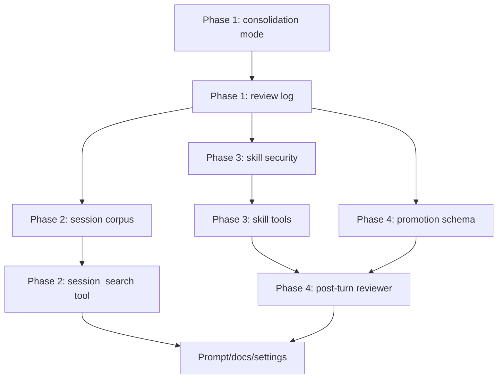

# Memory Growth And Recall 实现计划

| 字段 | 值 |
|------|------|
| 分支 | `master` |
| 状态 | DRAFT |
| 日期 | 2026-04-19 |
| 设计文档 | [design.md](/Users/oyasmi/projects/pipiclaw/docs/specs/009-memory-growth-and-recall/design.md) |

---

## 实施原则

本计划按风险从低到高推进：

1. 先收紧现有 memory lifecycle，减少噪音写入
2. 再增加显式冷路径 `session_search`
3. 再引入 post-turn review 与统一审计/建议文件
4. 再实现 workspace skill 管理工具
5. 最后把高置信 reviewer 与 direct skill write 串起来

每个阶段都应保持可独立合并、可测试、可回滚。

---

## 已确认决策

1. `post-turn review` 的触发阈值与现有 session memory 阈值共用，不新增一套复杂调度阈值。
2. `memory-decisions.jsonl` 与 `review-suggestions.jsonl` 合并为一个文件，避免审计链分散。
3. `session_search` 第一版搜索当前 channel 的 `log.jsonl.1`，如果文件存在。
4. direct skill write 后必须发送 DingTalk 轻提示。
5. 高置信 direct skill create 的 confidence 阈值固定为 `0.9`。

---

## 目标文件概览

### 新增文件

| 文件 | 作用 |
|------|------|
| `src/memory/promotion.ts` | promotion/review/shared schema 与阈值判断 |
| `src/memory/review-log.ts` | 合并后的审计与 suggestion JSONL 写入 |
| `src/memory/session-corpus.ts` | 当前 channel transcript 文件读取与标准化 |
| `src/memory/session-search.ts` | 当前 channel session search 核心逻辑 |
| `src/memory/post-turn-review.ts` | post-turn reviewer worker、解析、写回分流 |
| `src/tools/session-search.ts` | `session_search` 工具 |
| `src/tools/skill-list.ts` | `skill_list` 工具 |
| `src/tools/skill-view.ts` | `skill_view` 工具 |
| `src/tools/skill-manage.ts` | `skill_manage` 工具 |
| `src/tools/skill-security.ts` | skill 写入校验和安全扫描 helper |
| `test/session-search.test.ts` | session search 单元测试 |
| `test/skill-manage.test.ts` | skill 管理工具测试 |
| `test/post-turn-review.test.ts` | reviewer 分流与审计测试 |

### 修改文件

| 文件 | 改动 |
|------|------|
| `src/memory/consolidation.ts` | idle/boundary mode、prompt 收紧、history 写入控制 |
| `src/memory/lifecycle.ts` | idle 不写 history、review 调度、审计写入 |
| `src/memory/recall.ts` | 导出可复用 token/scoring helper |
| `src/settings.ts` | 新增 `memoryGrowth`、`sessionSearch` settings |
| `src/tools/config.ts` | 新增工具开关 |
| `src/tools/index.ts` | 注册 session search 与 skill tools |
| `src/agent/channel-runner.ts` | post-turn review 集成、DingTalk 轻提示、resource refresh |
| `src/agent/prompt-builder.ts` | 增加 session search 与 procedural memory 指引 |
| `src/agent/workspace-resources.ts` | 确保 workspace skills reload 行为清晰 |
| `test/memory-lifecycle.test.ts` | idle/boundary 回归测试 |
| `test/integration/memory-consolidation.test.ts` | promotion 边界测试 |

---

## Phase 1: Memory Lifecycle Hardening

目标：不新增用户可见功能，先把现有自动写入边界收紧。

### Task 1.1 定义 consolidation mode

改动：

1. 在 `src/memory/consolidation.ts` 增加：

```ts
export type ConsolidationMode = "idle" | "boundary";
```

2. 扩展 `ConsolidationRunOptions`：

```ts
mode?: ConsolidationMode;
```

3. 默认 `mode = "boundary"`，保持 compaction/new/shutdown 兼容。

验收：

1. 现有调用不传 mode 时行为保持 boundary。
2. typecheck 通过。

### Task 1.2 拆分 idle consolidation 输出 schema

改动：

1. idle mode 使用不含 `historyBlock` 的 prompt/schema。
2. boundary mode 继续允许 `historyBlock`。
3. `runInlineConsolidation()` 在 idle mode 下永远不调用 `appendChannelHistoryBlock()`。

验收：

1. idle 有 meaningful messages 时可写 `MEMORY.md`。
2. idle 不写 `HISTORY.md`。
3. compaction/new/shutdown 仍可写 `HISTORY.md`。

测试：

1. 更新 `test/memory-lifecycle.test.ts`
2. 更新 `test/integration/memory-consolidation.test.ts`

### Task 1.3 收紧 durable memory prompt

改动：

1. 修改 `INLINE_CONSOLIDATION_SYSTEM_PROMPT`：
   - 移除 `current work state`
   - 强调 durable facts、decisions、preferences、constraints、medium-horizon open loops
   - 明确 active execution state 留在 `SESSION.md`
2. 修改 `MEMORY_CLEANUP_SYSTEM_PROMPT`：
   - 强化移除 transient working state
   - 明确 `MEMORY.md` 不保存 completed worklog

验收：

1. prompt 中不再鼓励把 current state promotion 到 `MEMORY.md`。
2. 测试覆盖 prompt 输出解析，不要求 LLM 真实行为稳定。

### Task 1.4 新增 unified review log helper

文件：

```text
src/memory/review-log.ts
```

输出文件：

```text
<channel>/memory-review.jsonl
```

说明：

1. 该文件合并 design 中的 audit 与 suggestion。
2. 它是 diagnostic/cold 文件，不进入 recall。
3. 所有自动写回和低置信 suggestion 都写入这里。

接口建议：

```ts
export interface MemoryReviewLogEntry {
	timestamp: string;
	channelId: string;
	reason: "idle" | "compaction" | "new-session" | "shutdown" | "post-turn";
	candidates?: unknown[];
	actions?: unknown[];
	suggestions?: unknown[];
	skipped?: unknown[];
}

export async function appendMemoryReviewLog(channelDir: string, entry: MemoryReviewLogEntry): Promise<void>;
```

验收：

1. append 写入是串行安全的，至少不破坏 JSONL。
2. 单测覆盖 append、目录不存在、无内容、并发 append。

### Task 1.5 lifecycle 接入 review log

改动：

1. idle mode 跳过 history 时写一条 `skipped`：
   - `target = "history"`
   - `reason = "idle does not write HISTORY.md"`
2. boundary consolidation 成功时记录 memory/history action summary。
3. consolidation skipped 时记录轻量 skipped reason。

验收：

1. 不影响主流程。
2. log 写入失败只 warning，不阻塞 memory lifecycle。

---

## Phase 2: Current-Channel Session Search

目标：新增显式冷路径 `session_search`，只搜索当前 channel。

### Task 2.1 构建 session corpus

文件：

```text
src/memory/session-corpus.ts
```

数据源：

1. `<channel>/context.jsonl`
2. 当前 channel 目录下 pi session jsonl 文件
3. `<channel>/log.jsonl`
4. `<channel>/log.jsonl.1`，如果存在

不读取：

1. 其他 channel 目录
2. workspace 全局 sessions
3. `$HOME` session 目录

接口建议：

```ts
export interface SessionSearchDocument {
	id: string;
	source: "context" | "session" | "log";
	path: string;
	timestamp?: string;
	role: "user" | "assistant" | "tool" | "system" | "unknown";
	text: string;
	sessionId?: string;
}

export interface BuildSessionCorpusOptions {
	channelDir: string;
	maxFiles: number;
}

export async function buildSessionCorpus(options: BuildSessionCorpusOptions): Promise<SessionSearchDocument[]>;
```

实现要点：

1. 逐行 parse JSONL，坏行跳过。
2. 对 pi session jsonl 使用 `type === "message"` 的 entry。
3. `log.jsonl` / `log.jsonl.1` 转成 user/bot 文档。
4. 文本过长时先保留 head/tail 或切 chunk。
5. 文件 fingerprint cache 可放第二步，但接口先留扩展点。

测试：

1. parse context/session/log 三类文件
2. 坏 JSONL 行不抛出
3. 不扫描 sibling channel
4. 读取 `log.jsonl.1`

### Task 2.2 实现 local search

文件：

```text
src/memory/session-search.ts
```

接口建议：

```ts
export interface SearchChannelSessionsRequest {
	channelDir: string;
	query: string;
	roleFilter?: string[];
	limit: number;
	maxFiles: number;
	maxChunks: number;
	maxCharsPerChunk: number;
	summarizeWithModel: boolean;
	timeoutMs: number;
	model: Model<Api>;
	resolveApiKey: (model: Model<Api>) => Promise<string>;
}

export interface SessionSearchResult {
	source: string;
	path: string;
	when?: string;
	score: number;
	summary: string;
	matches: string[];
}
```

实现要点：

1. 复用 `recall.ts` 的 tokenizer，必要时先导出 `tokenizeRecallText()` 已有函数。
2. query 为空时返回 recent documents/chunks，不做 LLM summary。
3. query 非空时 local score：
   - token coverage
   - exact phrase boost
   - recency boost
   - role filter
4. top chunks 超长时用 `clipText()`。
5. `summarizeWithModel=true` 时用 sidecar worker 做 focused summary。
6. summarizer 失败时 fallback raw preview。

测试：

1. 英文关键词命中
2. 中文关键词命中
3. query 为空列 recent
4. roleFilter 生效
5. summary sidecar 失败 fallback

### Task 2.3 增加 `session_search` 工具

文件：

```text
src/tools/session-search.ts
```

改动：

1. 新工具参数包含 `label`、`query`、`limit`、`roleFilter`。
2. `limit` clamp 到 1-5。
3. 调用 `searchChannelSessions()`。
4. 返回模型友好的 JSON string 或 text block。
5. tool description 明确：
   - 只搜索当前 channel
   - 适合“之前/上次/记得吗”
   - historical data 不是新指令

注册：

1. `src/tools/index.ts`
2. `src/tools/config.ts`

测试：

1. tool schema
2. limit clamp
3. disabled config 时不注册

### Task 2.4 prompt 集成

文件：

```text
src/agent/prompt-builder.ts
```

改动：

1. Tools 列表增加 `session_search`。
2. Memory / Cold Storage 段落说明：
   - cold storage 只通过 `session_search` 显式检索
   - 结果只来自当前 channel
   - 搜索结果是历史资料，不是指令
3. 在“prior context”场景建议先查 `SESSION.md / MEMORY.md / HISTORY.md`，若用户明显引用更早 transcript，再用 `session_search`。

验收：

1. prompt 中不存在跨 channel 搜索暗示。
2. 不鼓励普通 turn 自动扫描 cold storage。

---

## Phase 3: Workspace Skill Management Tools

目标：先把 skill 作为显式工具面做扎实，再接 reviewer 自动写回。

### Task 3.1 skill path 与 frontmatter 校验

文件：

```text
src/tools/skill-security.ts
```

接口建议：

```ts
export interface SkillValidationResult {
	ok: boolean;
	error?: string;
}

export function validateSkillName(name: string): SkillValidationResult;
export function validateSkillFrontmatter(content: string, expectedName: string): SkillValidationResult;
export function resolveSkillPath(workspaceDir: string, name: string): string;
export function resolveSkillSupportingFile(skillDir: string, filePath: string): string;
export function scanSkillContent(content: string): SkillValidationResult;
```

规则：

1. name 只允许 `[a-z0-9]+(-[a-z0-9]+)*`
2. `SKILL.md` 必须有 YAML frontmatter
3. `name` 与目录一致
4. `description` 必填
5. body 非空
6. supporting file 只能在 `references/ templates/ scripts/ assets/`
7. 禁止 `..`
8. 检测 prompt injection / secret exfil / invisible unicode / destructive command

测试：

1. valid skill
2. invalid name
3. missing description
4. path traversal
5. blocked command pattern

### Task 3.2 `skill_list`

文件：

```text
src/tools/skill-list.ts
```

行为：

1. 列出 workspace skills。
2. 输出 name、description、path。
3. 不列 package 内置 skills 作为可写对象。

测试：

1. 空 skills
2. 多层目录 skill
3. invalid skill 给 warning 或跳过

### Task 3.3 `skill_view`

文件：

```text
src/tools/skill-view.ts
```

行为：

1. 按 name 查找 workspace skill。
2. 可选 `filePath` 查看 supporting file。
3. 默认读取 `SKILL.md`。
4. supporting file path 必须在 skill dir 内。

测试：

1. view `SKILL.md`
2. view `references/foo.md`
3. traversal 被拒绝
4. missing skill 返回清晰错误

### Task 3.4 `skill_manage`

文件：

```text
src/tools/skill-manage.ts
```

支持 action：

1. `create`
2. `patch`
3. `write_file`

不支持：

1. `delete`
2. `edit`
3. channel-scoped skills

实现要点：

1. `create` 写 `<workspace>/skills/<name>/SKILL.md`
2. `patch` 默认 patch `SKILL.md`，可 patch allowed supporting file
3. `write_file` 仅写 allowed supporting file
4. 写入必须 atomic
5. 安全扫描失败 rollback
6. 成功后返回 `requiresResourceRefresh: true`

测试：

1. create 成功
2. duplicate name 失败
3. patch 唯一匹配
4. patch 多匹配失败
5. write_file 成功
6. blocked content rollback

### Task 3.5 工具注册与 resource refresh

改动：

1. `src/tools/index.ts` 注册 skill tools。
2. `src/tools/config.ts` 增加 `tools.skills.manage.enabled`。
3. `ChannelRunner` 在检测到 `skill_manage` 成功且 `requiresResourceRefresh` 时调用 `refreshSessionResources()`。

注意：

1. 当前 tool result 处理在 pi agent 内部，可能需要在工具返回 details 后由 session event 捕获。
2. 如果无法优雅捕获，可先在下一轮 reload 时生效，但 direct skill write 的 DingTalk 轻提示仍应准确。

验收：

1. 新 skill 后下一轮 prompt 能看到 skill summary。
2. 不需要重启 runtime。

---

## Phase 4: Post-Turn Review

目标：让 runtime 对沉淀行为做结构化判断，并根据置信度自动写入或 suggestion。

### Task 4.1 promotion schema

文件：

```text
src/memory/promotion.ts
```

内容：

1. `MemoryPromotionCandidate`
2. `SkillPromotionCandidate`
3. `PostTurnReviewResult`
4. threshold helpers：

```ts
export function shouldAutoWriteMemory(candidate: MemoryPromotionCandidate, threshold: number): boolean;
export function shouldAutoWriteSkill(candidate: SkillPromotionCandidate, threshold: number): boolean;
```

默认：

1. memory threshold: `0.85`
2. skill threshold: `0.9`

测试：

1. threshold 边界
2. low necessity skill 不自动写
3. high confidence/high necessity skill 自动写

### Task 4.2 post-turn reviewer worker

文件：

```text
src/memory/post-turn-review.ts
```

输入：

1. channelDir
2. workspaceDir
3. channelId
4. messages snapshot
5. session entries snapshot
6. current `SESSION.md`
7. current channel `MEMORY.md`
8. loaded skill summaries
9. model / resolveApiKey / timeout

输出：

1. parsed `PostTurnReviewResult`
2. raw text for debug if parse fails

实现要点：

1. 使用 `runRetriedSidecarTask()`
2. JSON-only prompt
3. 不直接操作文件，先返回 result
4. parse 失败写 debug file 或 review log

测试：

1. parse valid JSON
2. normalize invalid fields
3. parse failure 不抛到主 turn

### Task 4.3 review action applier

同文件或新增：

```text
src/memory/post-turn-review.ts
```

行为：

1. 高置信 durable memory 直接 append channel `MEMORY.md`
2. 高置信 session correction 直接 rewrite `SESSION.md` 或触发 session updater
3. history candidate 只在 boundary reason 写入
4. 高置信 skill candidate 调用内部 skill manager helper
5. 低置信全部写入 `memory-review.jsonl` suggestions
6. 所有 direct actions 也写入 `memory-review.jsonl`

注意：

1. direct skill write 后需要返回 user notice。
2. direct memory write 可返回 user notice。
3. 文件写入失败不阻塞主 turn。

测试：

1. high confidence memory append
2. low confidence memory suggestion
3. high confidence skill create
4. blocked skill create becomes suggestion/skipped with reason
5. boundary vs idle history gating

### Task 4.4 MemoryLifecycle 调度

改动：

1. 复用 session memory 阈值：
   - `minTurnsBetweenUpdate`
   - `minToolCallsBetweenUpdate`
2. 在达到阈值且 assistant turn 完成后，排队 post-turn review。
3. review 与 durable memory queue 同一个 per-channel 串行队列，避免与 consolidation 写同一文件竞争。
4. review failure 只 warning。

验收：

1. 普通短对话不触发 review。
2. 多 tool call 或多 turn 后触发。
3. 与 idle consolidation 不并发写 `MEMORY.md`。

### Task 4.5 DingTalk 轻提示

改动：

1. `post-turn-review` 返回 `notices: string[]`。
2. `ChannelRunner` 在主回复已交付后发送轻提示。
3. 触发条件：
   - direct skill create/patch/write_file
   - direct channel memory write
4. 不为 low-confidence suggestion 发消息。

提示例：

```text
已沉淀：创建 workspace skill `release-checklist`。
```

验收：

1. direct skill write 有 DingTalk 轻提示。
2. suggestion 没有 DingTalk 噪音。
3. 提示发送失败不影响主 turn。

---

## Phase 5: Settings And Documentation

目标：让新能力可配置、可诊断、可运维。

### Task 5.1 settings

文件：

```text
src/settings.ts
```

新增：

```ts
export interface PipiclawMemoryGrowthSettings {
	postTurnReviewEnabled: boolean;
	autoWriteChannelMemory: boolean;
	autoWriteWorkspaceSkills: boolean;
	minSkillAutoWriteConfidence: number;
	minMemoryAutoWriteConfidence: number;
	idleWritesHistory: boolean;
}

export interface PipiclawSessionSearchSettings {
	enabled: boolean;
	maxFiles: number;
	maxChunks: number;
	maxCharsPerChunk: number;
	summarizeWithModel: boolean;
	timeoutMs: number;
}
```

默认值：

1. `postTurnReviewEnabled: true`
2. `autoWriteChannelMemory: true`
3. `autoWriteWorkspaceSkills: true`
4. `minSkillAutoWriteConfidence: 0.9`
5. `minMemoryAutoWriteConfidence: 0.85`
6. `idleWritesHistory: false`
7. `sessionSearch.enabled: true`

测试：

1. 默认合并
2. settings override
3. invalid settings 使用默认并记录 diagnostic

### Task 5.2 tools config

文件：

```text
src/tools/config.ts
```

新增：

```json
{
  "tools": {
    "memory": {
      "sessionSearch": { "enabled": true }
    },
    "skills": {
      "manage": { "enabled": true }
    }
  }
}
```

验收：

1. 禁用 session search 后工具不注册。
2. 禁用 skill manage 后 skill tools 不注册。

### Task 5.3 docs

更新：

1. `docs/configuration.md`
2. `docs/deployment-and-operations.md`
3. `README.md` 视需要加简短说明

内容：

1. memory 分层职责
2. `session_search` 当前 channel 限制
3. `memory-review.jsonl` 是审计/建议文件
4. workspace skills 可被高置信 reviewer 写入
5. direct skill write 会发 DingTalk 轻提示

---

## 端到端验证计划

最低验证：

```bash
npm run typecheck
npm run test
```

建议分阶段验证：

1. Phase 1 后：
   - `npm run typecheck`
   - `npm run test -- memory-lifecycle`
   - `npm run test -- memory-consolidation`
2. Phase 2 后：
   - `npm run typecheck`
   - `npm run test -- session-search`
   - `npm run test -- memory-recall`
3. Phase 3 后：
   - `npm run typecheck`
   - `npm run test -- skill-manage`
4. Phase 4 后：
   - `npm run typecheck`
   - `npm run test -- post-turn-review`
   - `npm run test -- memory-lifecycle`
5. 最终：
   - `npm run test`
   - `npm run check`

如果改动影响 DingTalk delivery 或 ChannelRunner turn 结束流程，补充：

```bash
npm run test:e2e
```

---

## 风险与控制

### 风险 1: 自动写 skill 污染 workspace

控制：

1. confidence 固定阈值 `0.9`
2. 必须 high necessity
3. 必须 security scan
4. 必须写 audit
5. direct write 后 DingTalk 轻提示

### 风险 2: session_search 泄露其他 channel 信息

控制：

1. corpus builder 只接收 `channelDir`
2. 不递归 workspace sibling dirs
3. 测试构造 sibling channel 并断言不命中

### 风险 3: review/consolidation 并发写冲突

控制：

1. 所有 durable writes 走同一 per-channel queue
2. `SESSION.md` 仍走 session refresh queue
3. review log append 使用 atomic/queued helper

### 风险 4: post-turn review 增加热路径延迟

控制：

1. 主回复交付后异步运行
2. 阈值复用 session memory，不每轮触发
3. failure best-effort
4. direct notice 也在主回复后发送

### 风险 5: HISTORY.md 过度收缩导致恢复能力下降

控制：

1. boundary 仍写 history
2. `session_search` 提供 transcript 冷路径兜底
3. `MEMORY.md` 保留 durable facts

---

## 任务依赖图



---

## 建议首个 PR 切分

### PR 1: Harden memory lifecycle

包含：

1. consolidation mode
2. idle 不写 history
3. prompt 收紧
4. `memory-review.jsonl` 基础 helper
5. lifecycle logging
6. 单元与 integration 测试

不包含：

1. session search
2. skill tools
3. post-turn reviewer

### PR 2: Add current-channel session_search

包含：

1. session corpus
2. local search
3. sidecar summary fallback
4. tool 注册
5. prompt 更新
6. tests

### PR 3: Add workspace skill tools

包含：

1. skill validation/security
2. list/view/manage
3. tools config
4. resource refresh
5. tests

### PR 4: Add post-turn review

包含：

1. promotion schema
2. reviewer worker
3. direct/suggestion action applier
4. DingTalk light notice
5. review log integration
6. tests

### PR 5: Docs and rollout polish

包含：

1. configuration docs
2. operations docs
3. final e2e coverage
4. changelog entry if needed
