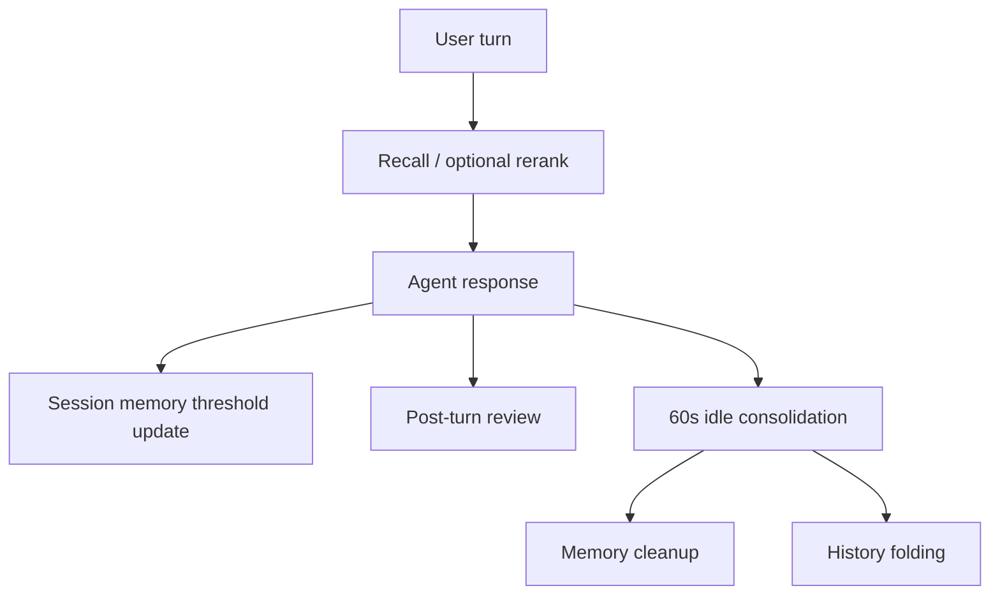
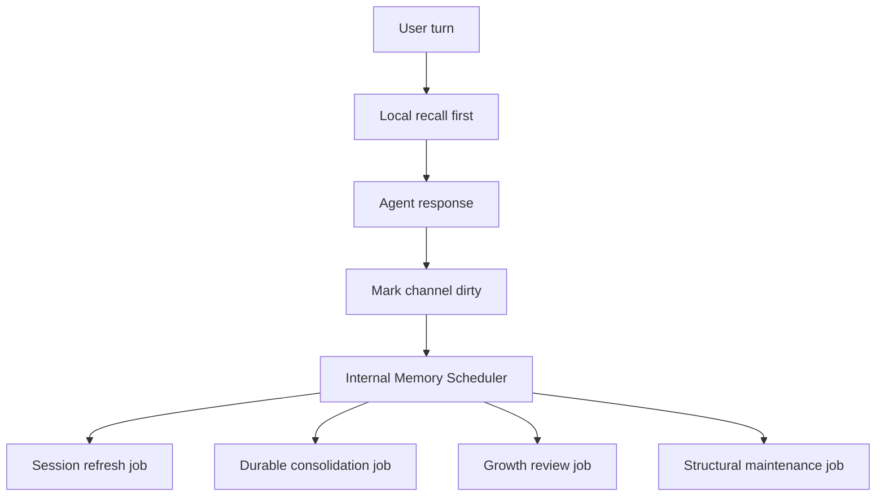
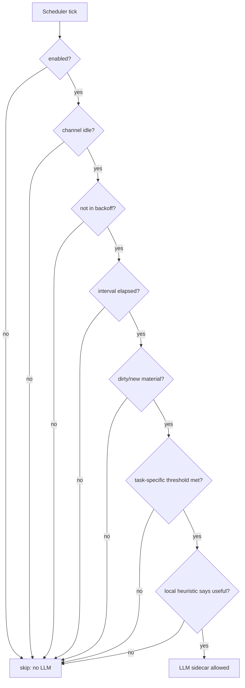

# Memory Maintenance Scheduler 设计方案

| 字段 | 值 |
|------|------|
| 分支 | `master` |
| 状态 | DRAFT |
| 日期 | 2026-04-19 |
| 关联 spec | `docs/specs/009-memory-growth-and-recall/design.md` |
| 关联实现 | `src/memory/lifecycle.ts`, `src/memory/consolidation.ts`, `src/memory/post-turn-review.ts`, `src/runtime/events.ts` |

---

## 背景

spec 009 已经把 Pipiclaw 的 memory 能力扩展到：

1. 分层 memory 文件职责更清晰
2. 当前 channel 的 `session_search`
3. workspace skill 管理工具
4. post-turn review
5. `memory-review.jsonl` 审计与 suggestion

但随之出现一个新问题：完整 turn 附近可能触发多次 LLM sidecar 调用。

当前可能出现的 sidecar 来源包括：

1. `recall rerank`：每次 turn 开始时可能触发
2. `session memory update`：达到阈值后触发
3. `post-turn review`：达到阈值后触发
4. `idle consolidation`：assistant turn 后 60 秒触发
5. `memory cleanup`：idle 后联动
6. `history folding`：idle 后联动
7. `session_search summary`：工具调用时若开启 model summary 触发

这些任务里，只有少数与“当前用户等待这次回复”强相关。大量任务是整理、沉淀、折叠、提升，可以延迟、合并、低频执行。如果它们在用户刚发消息或刚收到回复后密集运行，会带来两个问题：

1. 用户体感响应变慢或后续 turn 抢占模型资源
2. LLM token 消耗明显增加，且很多调用实际没有必要

spec 010 的目标是把 memory sidecar 调用从“turn 附近即时触发”调整为“热路径克制 + 内置后台批处理”，在不降低可恢复性和可审计性的前提下降低 token 消耗。

---

## 设计立场

Pipiclaw 的 memory 维护不应该作为用户显式事件暴露在 `workspace/events/` 里。

现有 [EventsWatcher](/Users/oyasmi/projects/pipiclaw/src/runtime/events.ts) 的语义是：

1. 用户或外部系统写入 `workspace/events/*.json`
2. runtime 解析文件
3. 转成 synthetic DingTalk event
4. 通过普通 agent turn 处理

这个机制适合提醒、巡检、日报、用户可见周期任务，不适合作为 memory maintenance 的底层协议。原因：

1. 用户会看到这些事件文件，容易困惑
2. 用户可能主动删除文件，影响 memory 维护
3. memory maintenance 会变成普通 DingTalk turn，反而消耗更多上下文和 token
4. 维护任务不应该默认给用户发送完整回复
5. 难以保证和 memory 文件写入队列的强一致性

所以 spec 010 的原则是：

> 复用调度思想和底层 cron/timer 能力，不复用 `events/` 文件协议，也不通过 `bot.enqueueEvent()` 注入用户 turn。

---

## 目标

1. 降低普通 turn 附近的 LLM sidecar 调用数量
2. 把 post-turn review、durable consolidation、cleanup、history folding 迁移到内置后台 scheduler
3. 对每类后台任务建立明确的无 LLM 跳过条件
4. 避免把内部 memory job 暴露成用户可见 event 文件
5. 保持 channel/workspace memory 分层不变
6. 保持 `memory-review.jsonl` 审计链
7. 保留 compaction、`/new`、shutdown 前的必要边界刷新

---

## 非目标

1. 不引入 vector database 或 embedding
2. 不把 memory maintenance 放进 `workspace/events/`
3. 不让内置 scheduler 给 agent 注入普通用户消息
4. 不默认跨 channel 合并 transcript
5. 不让后台任务无限并发调用 LLM
6. 不把低置信 suggestion 自动写入 workspace skill
7. 不牺牲 compaction 前的恢复正确性

---

## 新运行模型

### 当前模型



问题是 D/E/F/G/H 都可能在用户使用期间触发 LLM sidecar。

### 目标模型



普通 turn 后只记录 dirty state 和 counters。真正的 LLM work 由内置 scheduler 在合适时间批量执行。

---

## 热路径保留内容

普通用户 turn 中只保留下面能力：

1. local memory recall
2. 必要时读取 `SESSION.md / MEMORY.md / HISTORY.md`
3. 用户显式使用 `session_search` 时做本地 cold search
4. compaction、`/new`、shutdown 前的强制 session refresh / boundary consolidation

默认不在普通 turn 附近立即触发：

1. post-turn review
2. idle durable extraction
3. memory cleanup
4. history folding
5. skill promotion review
6. model-based session search summary
7. unconditional recall rerank

---

## 内置 Scheduler

新增内置服务：

```text
src/memory/scheduler.ts
```

职责：

1. 周期性扫描 channel memory maintenance state
2. 判断哪些 channel 有后台 memory job 需要运行
3. 确保 channel 最近不活跃时才运行 LLM work
4. 控制并发，默认一次只处理一个 channel
5. 调用 memory domain 内部 API，而不是发 DingTalk event
6. 写入 `memory-review.jsonl`

runtime 接入位置：

```text
src/runtime/bootstrap.ts
```

生命周期：

1. runtime start 时启动
2. runtime shutdown 时停止
3. shutdown 时不主动跑完整后台维护，只 flush 必要边界 memory

不使用：

```text
workspace/events/*.json
bot.enqueueEvent()
普通 DingTalk synthetic event
```

可复用：

1. `croner`
2. 现有 runtime start/stop 模式
3. 现有日志风格
4. 现有 security/config diagnostics 风格

---

## 隐藏状态文件

新增内部状态文件，不放在 workspace event 目录。

建议路径：

```text
~/.pi/pipiclaw/state/memory/<channelId>.json
```

如果设置了 `PIPICLAW_HOME`：

```text
${PIPICLAW_HOME}/state/memory/<channelId>.json
```

状态示例：

```json
{
  "channelId": "dm_xxx",
  "dirty": true,
  "lastActivityAt": "2026-04-19T10:30:00.000Z",
  "eligibleAfter": "2026-04-19T10:40:00.000Z",
  "lastSessionRefreshAt": "2026-04-19T10:00:00.000Z",
  "lastDurableConsolidationAt": "2026-04-19T09:45:00.000Z",
  "lastGrowthReviewAt": "2026-04-19T09:00:00.000Z",
  "lastStructuralMaintenanceAt": "2026-04-19T03:00:00.000Z",
  "turnsSinceSessionRefresh": 3,
  "toolCallsSinceSessionRefresh": 5,
  "turnsSinceGrowthReview": 8,
  "toolCallsSinceGrowthReview": 16,
  "lastConsolidatedEntryId": "msg-120",
  "lastReviewedEntryId": "msg-118",
  "failureBackoffUntil": null
}
```

设计要求：

1. 状态文件丢失时可重建
2. 状态文件损坏时 warning 并重建，不阻塞 runtime
3. 状态只用于调度，不作为权威 memory source
4. 用户不需要理解或编辑这些文件

---

## Dirty 标记

普通 turn 结束后不直接跑 LLM，而是记录：

1. `dirty = true`
2. `lastActivityAt = now`
3. `eligibleAfter = now + minIdleMinutesBeforeLlmWork`
4. turn/tool counters
5. latest session entry id if available

工具调用后记录：

1. `toolCallsSinceSessionRefresh += 1`
2. `toolCallsSinceGrowthReview += 1`
3. `dirty = true`

用户新 turn 开始时：

1. 更新 `lastActivityAt`
2. 推迟 `eligibleAfter`
3. 不启动后台 LLM work

这样可以避免用户连续交互时后台 sidecar 和主 turn 抢资源。

---

## 四类内置任务

### 1. Session Refresh Job

目标：维护 `SESSION.md`，保留当前工作态。

默认频率：

```text
每 10 分钟扫描一次 eligible channel
```

LLM 调用函数：

```text
updateChannelSessionMemory()
```

必须满足全部条件才允许调用 LLM：

1. `sessionMemory.enabled === true`
2. channel `dirty === true`
3. `now >= eligibleAfter`
4. channel 当前没有 active runner / streaming turn
5. `turnsSinceSessionRefresh >= minTurnsBetweenUpdate` 或 `toolCallsSinceSessionRefresh >= minToolCallsBetweenUpdate`
6. 当前 branch 中存在未反映进 `SESSION.md` 的 meaningful assistant/user material
7. 不在 failure backoff 中

必须无 LLM 跳过的情况：

1. `SESSION.md` 不存在变化必要：跳过
2. counters 未达到阈值：跳过
3. channel 最近仍活跃：跳过
4. 上次 refresh 后没有新 session entry：跳过
5. 当前只有 command/no-op/silent response：跳过
6. model/api key 不可用：跳过并记录 backoff

边界例外：

1. compaction 前仍可强制 refresh
2. `/new` 前仍可强制 refresh
3. shutdown 前仍可强制 refresh

这些边界调用不是 scheduler 的普通周期任务，而是恢复正确性保护。

### 2. Durable Consolidation Job

目标：把近期 transcript 中真正 durable 的 facts/decisions/preferences/open loops 写入 channel `MEMORY.md`。

默认频率：

```text
每 20 分钟扫描一次 eligible channel
```

LLM 调用函数：

```text
runInlineConsolidation({ mode: "idle" })
```

但它不再由 60 秒 idle timer 直接触发。60 秒 idle timer 只标记 dirty / eligible。

必须满足全部条件才允许调用 LLM：

1. channel `dirty === true`
2. `now >= eligibleAfter`
3. channel 当前没有 active runner / streaming turn
4. 距离 `lastDurableConsolidationAt` 超过配置间隔
5. 存在 `lastConsolidatedEntryId` 之后的新 meaningful exchange
6. 新内容数量达到最小批量阈值，例如 `minTurnsBetweenDurableConsolidation`
7. post-turn/growth review 没有已经覆盖相同 entry range 的 durable memory actions
8. 不在 failure backoff 中

必须无 LLM 跳过的情况：

1. 没有新 meaningful exchange：跳过
2. 只有 tool progress 或错误噪音：跳过
3. 新内容过少且未到最长等待时间：跳过
4. 最近已经做过 growth review 且写过 memory：跳过 durable extraction
5. `MEMORY.md` 最近已由同一 entry range 更新：跳过
6. channel 活跃：跳过

输出限制：

1. 只写 `MEMORY.md`
2. 不写 `HISTORY.md`
3. action/skipped 写入 `memory-review.jsonl`

### 3. Growth Review Job

目标：批量判断哪些内容值得 promotion，包括 channel memory 和 workspace skill。

默认频率：

```text
每 60 分钟扫描一次 eligible channel
```

LLM 调用函数：

```text
runPostTurnReview()
```

但它不再是 turn 后即时 review，而是 scheduled batch review。

必须满足全部条件才允许调用 LLM：

1. `memoryGrowth.postTurnReviewEnabled === true`
2. channel `dirty === true`
3. `now >= eligibleAfter`
4. channel 当前没有 active runner / streaming turn
5. `turnsSinceGrowthReview >= minTurnsBetweenReview` 或 `toolCallsSinceGrowthReview >= minToolCallsBetweenReview`
6. 存在 `lastReviewedEntryId` 之后的新 meaningful material
7. 新内容中至少有潜在 durable fact 或 reusable workflow 信号
8. 不在 failure backoff 中

可先用本地 heuristic 判断是否有 promotion 信号，避免无意义 LLM：

1. 用户明确表达长期偏好：`以后`, `记住`, `默认`, `偏好`
2. 明确决策：`决定`, `确认`, `采用`, `不再`
3. 可复用流程：`流程`, `步骤`, `规范`, `checklist`, `每次`, `以后都`
4. workspace skill 相关：多次重复的操作步骤、发布/测试/排障流程
5. 中期 open loop：`后续`, `待办`, `需要跟进`

必须无 LLM 跳过的情况：

1. 未达到 review 阈值：跳过
2. 本地 heuristic 没有 promotion 信号：跳过
3. 上次 review 后没有新 session entry：跳过
4. 近期只有普通问答、闲聊、一次性代码执行：跳过
5. channel 活跃：跳过
6. skill auto write 被禁用且没有 memory candidate 信号：跳过 skill 相关判断

写回策略：

1. 高置信 channel memory 直接写 `MEMORY.md`
2. 高置信 reusable workflow 可写 workspace `skills/`
3. skill direct create 阈值固定 `0.9`
4. 低置信或 blocked candidate 写 `memory-review.jsonl` suggestion
5. direct write 后发 DingTalk 轻提示，但应合并为 digest

建议轻提示格式：

```text
已沉淀：更新 channel memory 2 条，创建 workspace skill `release-checklist`。
```

### 4. Structural Maintenance Job

目标：低频整理已有 memory 文件结构，降低长期噪音。

默认频率：

```text
每 6 小时扫描一次 eligible channel
```

可能调用：

1. `cleanupChannelMemory()`
2. `foldChannelHistory()`

必须先用本地文件阈值判断，只有超过阈值才允许调用 LLM。

Memory cleanup 的 LLM 前置条件：

1. `MEMORY.md` 字符数超过阈值，例如 `5000`
2. 或 `## Update` block 数超过阈值，例如 `4`
3. 距离上次 cleanup 超过最小间隔
4. channel 当前不活跃
5. 不在 failure backoff 中

History folding 的 LLM 前置条件：

1. `HISTORY.md` 字符数超过阈值，例如 `8000`
2. 或 H2 block 数超过阈值，例如 `5`
3. block 数大于 recent keep 数
4. 距离上次 folding 超过最小间隔
5. channel 当前不活跃
6. 不在 failure backoff 中

必须无 LLM 跳过的情况：

1. 文件长度未超过阈值：跳过
2. block 数未超过阈值：跳过
3. 最近刚 maintenance 过：跳过
4. channel 活跃：跳过
5. 文件不存在或为空模板：跳过
6. 没有足够旧 blocks 可 fold：跳过

Structural maintenance 不做：

1. 新 memory promotion
2. skill creation
3. DingTalk 普通提示

除非连续失败或需要人工干预，否则只写日志和 `memory-review.jsonl`。

---

## LLM 调用门禁

所有后台任务必须遵守统一门禁：



要求：

1. 每个 skip reason 都应可记录到 debug log 或 `memory-review.jsonl`
2. skip path 不能调用 sidecar
3. 文件长度、entry id、counters、时间间隔、active runner 状态都必须在 LLM 前判断
4. sidecar failure 设置 backoff
5. backoff 期间只做本地判断，不调用 LLM

---

## 配置建议

新增 settings：

```ts
export interface PipiclawMemoryMaintenanceSettings {
  enabled: boolean;
  minIdleMinutesBeforeLlmWork: number;
  sessionRefreshIntervalMinutes: number;
  durableConsolidationIntervalMinutes: number;
  growthReviewIntervalMinutes: number;
  structuralMaintenanceIntervalHours: number;
  maxConcurrentChannels: number;
  failureBackoffMinutes: number;
}
```

默认值建议：

```json
{
  "memoryMaintenance": {
    "enabled": true,
    "minIdleMinutesBeforeLlmWork": 10,
    "sessionRefreshIntervalMinutes": 10,
    "durableConsolidationIntervalMinutes": 20,
    "growthReviewIntervalMinutes": 60,
    "structuralMaintenanceIntervalHours": 6,
    "maxConcurrentChannels": 1,
    "failureBackoffMinutes": 30
  },
  "memoryGrowth": {
    "postTurnReviewEnabled": true,
    "minTurnsBetweenReview": 12,
    "minToolCallsBetweenReview": 24,
    "minSkillAutoWriteConfidence": 0.9,
    "minMemoryAutoWriteConfidence": 0.85
  },
  "memoryRecall": {
    "rerankWithModel": "auto"
  },
  "sessionSearch": {
    "summarizeWithModel": false
  }
}
```

说明：

1. `memoryMaintenance.enabled=false` 时，只保留 compaction/new/shutdown 边界保存
2. `maxConcurrentChannels=1` 是默认安全值，避免多个 channel 同时打满 LLM
3. `minIdleMinutesBeforeLlmWork=10` 防止用户连续对话时后台任务抢资源
4. `sessionSearch.summarizeWithModel=false` 保持工具默认低成本

---

## Recall Rerank 策略

spec 010 同时建议调整 recall rerank 默认策略。

当前：

```text
每次 turn 开始可能用 LLM rerank
```

建议：

```text
默认 local scoring
必要时 auto rerank
```

`memoryRecall.rerankWithModel` 可扩展为：

```ts
boolean | "auto"
```

`auto` 条件：

1. local top candidates 分数接近，区分度低
2. query 明确涉及历史恢复、决策、偏好、错误纠正
3. 用户消息包含中文且 local tokenizer 置信度低
4. candidate 数超过本地排序信心阈值

必须无 LLM 跳过：

1. recall disabled
2. candidate 数为 0
3. local top score 足够高
4. query 明显是简单当前任务
5. prompt budget 紧张

---

## Session Search Summary 策略

`session_search` 第一优先级仍是本地搜索。

默认：

```json
{
  "sessionSearch": {
    "summarizeWithModel": false
  }
}
```

只有满足全部条件才允许 summary sidecar：

1. 用户或配置显式启用 model summary
2. 搜索结果超过 preview 上限
3. query 非空
4. top results 足够相关
5. 不在全局 LLM maintenance pressure 限制中

必须无 LLM 跳过：

1. query 为空
2. 无结果
3. top result preview 已足够短
4. `summarizeWithModel=false`
5. sidecar 最近失败进入 backoff

---

## 并发与锁

需要抽出 channel memory 写入队列，避免 scheduler 和 turn lifecycle 并发写同一文件。

建议新增：

```text
src/memory/channel-maintenance-queue.ts
```

接口草案：

```ts
export function runChannelMemoryJob<T>(
  channelId: string,
  job: () => Promise<T>
): Promise<T>;
```

使用方：

1. `MemoryLifecycle`
2. `MemoryMaintenanceScheduler`
3. post-turn/growth review applier
4. consolidation
5. cleanup/folding

要求：

1. 同一 channel 串行
2. 不同 channel 可受 `maxConcurrentChannels` 控制
3. 写 `MEMORY.md / HISTORY.md / SESSION.md / memory-review.jsonl / skills/` 的任务都应有明确队列策略
4. scheduler 不应绕过队列直接写文件

---

## 与 spec 009 的关系

spec 009 提供能力：

1. `session_search`
2. skill tools
3. post-turn review
4. review log
5. idle/boundary consolidation mode

spec 010 调整触发时机：

1. post-turn review 从 turn 后即时触发改为 scheduled batch review
2. idle consolidation 从 60 秒 LLM 调用改为 dirty marker + scheduled durable consolidation
3. cleanup/folding 从 idle 联动改为 structural maintenance
4. recall rerank 改为 local-first / auto
5. session search summary 保持默认关闭

底层文件资产不变：

1. `SESSION.md`
2. `MEMORY.md`
3. `HISTORY.md`
4. `context.jsonl`
5. `log.jsonl`
6. `log.jsonl.1`
7. `memory-review.jsonl`
8. workspace `skills/`

---

## 失败与降级

后台任务失败不能影响用户 turn。

失败策略：

1. sidecar timeout：记录 warning，设置 task/channel backoff
2. parse failure：写 `memory-review.jsonl` skipped/error
3. file write failure：记录 warning，保留 dirty
4. skill write blocked：candidate 转 suggestion
5. model/api key unavailable：跳过并 backoff

恢复策略：

1. backoff 到期后重试
2. 重启后从 state 文件恢复
3. state 丢失时从 channel files 和 session entries 重建 conservative 状态
4. 不因为后台失败阻塞 compaction 前强制保存

---

## 成功标准

### Latency

1. 普通 turn 完成后不立即启动 post-turn review sidecar
2. 普通 turn 完成后不立即启动 idle consolidation sidecar
3. cleanup/folding 不再由 60 秒 idle 链路触发
4. 用户连续对话期间后台 LLM job 自动推迟

### Token Cost

1. 无 dirty/new material 时 scheduler tick 不调用 LLM
2. 未达到阈值时不调用 LLM
3. 文件未超过 cleanup/folding 阈值时不调用 LLM
4. recall rerank 默认不每 turn 调用 LLM
5. `session_search` 默认不调用 summary LLM

### Correctness

1. compaction、`/new`、shutdown 前仍保留必要 memory save
2. channel memory 文件写入仍串行
3. `memory-review.jsonl` 保留 action/suggestion/skipped 审计
4. workspace skill direct write 仍有安全扫描和 DingTalk 轻提示

### Operability

1. 内置 scheduler 可关闭
2. 内置 scheduler 不依赖 `workspace/events/`
3. 用户删除 `workspace/events/` 文件不影响 memory maintenance
4. 维护状态损坏可重建

---

## 建议实施顺序

### Phase 1: Hot Path Cost Reduction

1. turn 后 post-turn review 改为只标记 dirty
2. 60 秒 idle consolidation 改为只标记 eligible
3. cleanup/folding 从 idle 链路移除
4. recall rerank 默认 local-first
5. `session_search` summary 继续默认关闭

### Phase 2: Internal Scheduler

1. 新增 `MemoryMaintenanceScheduler`
2. 新增 hidden maintenance state
3. runtime bootstrap start/stop scheduler
4. 支持 channel idle 判断和 max concurrency

### Phase 3: Scheduled Jobs

1. session refresh job
2. durable consolidation job
3. growth review job
4. structural maintenance job
5. 每个 job 加 no-LLM skip tests

### Phase 4: Queue And Observability

1. 抽 channel memory queue
2. scheduler 与 lifecycle 共用队列
3. 完善 `memory-review.jsonl` skipped reason
4. 增加 diagnostics/logging

### Phase 5: Documentation And Rollout

1. 更新 `docs/configuration.md`
2. 更新 `docs/deployment-and-operations.md`
3. 增加 cost/latency 调优说明
4. 增加迁移说明：spec009 即时 review 到 spec010 scheduled review

---

## 测试要求

重点不是“能调用 LLM”，而是“该不调用时绝不调用”。

必须覆盖：

1. no dirty channel：四类 job 都不调用 sidecar
2. channel active：四类 job 都不调用 sidecar
3. threshold not met：对应 job 不调用 sidecar
4. file under cleanup threshold：structural maintenance 不调用 sidecar
5. no new session entries：session refresh / consolidation / growth review 不调用 sidecar
6. backoff active：所有 LLM job 不调用 sidecar
7. eligible channel：只调用对应 job，不串到其他 job
8. multiple channels：遵守 `maxConcurrentChannels`
9. scheduler stop：不再触发后续 job
10. compaction boundary：即使 scheduler 关闭，仍可强制保存

---

## 结论

spec 010 的核心是把 memory 系统从“即时整理”改成“后台批处理”：

```text
Turn-time:
  local recall
  optional local session_search
  boundary-only forced memory save

After turn:
  mark dirty
  update counters

Internal scheduler:
  delayed SESSION.md refresh
  batched durable consolidation
  batched growth review
  low-frequency cleanup/folding
```

这能显著降低用户感知延迟和 token 消耗，同时保留 spec 009 引入的文件型、可审计、分层 memory 成长能力。
